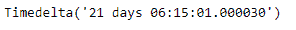
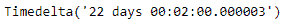

# Python | Pandas 时间增量指数. max

> 哎哎哎:# t0]https://www . geeksforgeeks . org/python-pandas-time delta index-max/

Python 是进行数据分析的优秀语言，主要是因为以数据为中心的 python 包的奇妙生态系统。 ***【熊猫】*** 就是其中一个包，让导入和分析数据变得容易多了。

熊猫 `**TimedeltaIndex.max()**`函数返回时间增量索引对象的最大值或沿轴的最大值。

> **语法:**时针索引. max(轴=None，*args，* quartz)
> 
> **参数:**无
> 
> **返回:**时间增量对象

**示例#1:** 使用`TimedeltaIndex.max()`函数找到给定时间增量索引对象中的最大值。

```py
# importing pandas as pd
import pandas as pd

# Create the TimedeltaIndex object
tidx = pd.TimedeltaIndex(data =['3 days 06:05:01.000030', '1 days 06:05:01.000030',
                                '3 days 06:05:01.000030', '1 days 02:00:00',
                                                 '21 days 06:15:01.000030'])

# Print the TimedeltaIndex object
print(tidx)
```

**输出:**


现在我们将使用`TimedeltaIndex.max()`函数来查找 tidx 对象中的最大值。

```py
# find maximum value
tidx.max()
```

**输出:**

正如我们在输出中看到的，`TimedeltaIndex.max()`函数已经返回了给定时间增量索引对象中的最大值。

**示例#2:** 使用`TimedeltaIndex.max()`函数查找给定时间增量索引对象中的最大值。

```py
# importing pandas as pd
import pandas as pd

# Create the TimedeltaIndex object
tidx = pd.TimedeltaIndex(data =['06:05:01.000030', '3 days 06:05:01.000030',
                                '22 day 2 min 3us 10ns', '+23:59:59.999999',
                             '13 days 06:05:01.000030', '+12:19:59.999999'])

# Print the TimedeltaIndex object
print(tidx)
```

**输出:**

现在我们将使用`TimedeltaIndex.max()`功能来查找 tidx 对象中的最大值。

```py
# find maximum value
tidx.max()
```

**输出:**

正如我们在输出中看到的，`TimedeltaIndex.max()`函数已经返回了给定时间增量索引对象中的最大值。