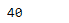
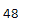

# python | pandas time delta index . memory _ usage

> 哎哎哎:# t0]https://www . geeksforgeeks . org/python 熊猫-time delta index-memory _ usage/

Python 是进行数据分析的优秀语言，主要是因为以数据为中心的 python 包的奇妙生态系统。 ***【熊猫】*** 就是其中一个包，让导入和分析数据变得容易多了。

熊猫 `**TimedeltaIndex.memory_usage()**`函数返回给定时间增量索引对象的内存使用情况。它返回存储对象所需的字节数。

> **语法:**time delta index . memory _ usage(deep = False)
> 
> **参数:**
> **深度:**深度内省数据，针对系统级内存消耗询问对象数据类型
> 
> **返回:**已用字节

**示例#1:** 使用`TimedeltaIndex.memory_usage()`函数查找给定时间增量索引对象的内存使用情况。

```py
# importing pandas as pd
import pandas as pd

# Create the TimedeltaIndex object
tidx = pd.TimedeltaIndex(data =['3 days 06:05:01.000030', '1 days 06:05:01.000030', 
                                '3 days 06:05:01.000030', '1 days 02:00:00',
                                                 '21 days 06:15:01.000030'])

# Print the TimedeltaIndex object
print(tidx)
```

**输出:**


现在我们将使用`TimedeltaIndex.memory_usage()`函数来查找存储对象所需的内存。

```py
# find memory usage for tidx
tidx.memory_usage(deep = True)
```

**输出:**

正如我们在输出中看到的，`TimedeltaIndex.memory_usage()`函数返回了 40，表示需要 40 个字节来存储给定的 TimedeltaIndex 对象。

**示例 2:** 使用`TimedeltaIndex.memory_usage()`函数查找给定 TimedeltaIndex 对象的内存使用情况。

```py
# importing pandas as pd
import pandas as pd

# Create the TimedeltaIndex object
tidx = pd.TimedeltaIndex(data =['06:05:01.000030', '3 days 06:05:01.000030',
                                '22 day 2 min 3us 10ns', '+23:59:59.999999', 
                             '13 days 06:05:01.000030', '+12:19:59.999999'])

# Print the TimedeltaIndex object
print(tidx)
```

**输出:**


现在我们将使用`TimedeltaIndex.memory_usage()`函数来查找存储对象所需的内存。

```py
# find memory usage for tidx
tidx.memory_usage(deep = True)
```

**输出:**

正如我们在输出中看到的，`TimedeltaIndex.memory_usage()`函数返回了 48，表示需要 48 个字节来存储给定的 TimedeltaIndex 对象。