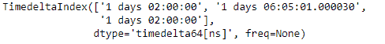
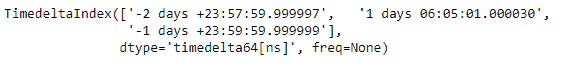
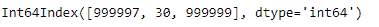

# Python | Pandas TimedeltaIndex .微秒

> 原文:[https://www . geesforgeks . org/python-pandas-time deltaindex-微秒/](https://www.geeksforgeeks.org/python-pandas-timedeltaindex-microseconds/)

Python 是进行数据分析的优秀语言，主要是因为以数据为中心的 python 包的奇妙生态系统。 ***【熊猫】*** 就是其中一个包，让导入和分析数据变得容易多了。

熊猫 `**TimedeltaIndex.microseconds**`属性返回时间增量索引对象中每个元素的微秒数。返回值的范围从 0 到小于 1 秒。

> **语法:**时间增量索引微秒
> 
> **返回:**索引对象

**示例#1:** 使用`TimedeltaIndex.microseconds`属性找出时间增量索引对象的每个条目的微秒值。

```py
# importing pandas as pd
import pandas as pd

# Create the TimedeltaIndex object
tidx = pd.TimedeltaIndex(data =['1 days 02:00:00', '1 days 06:05:01.000030',
                                                         '1 days 02:00:00'])

# Print the TimedeltaIndex
print(tidx)
```

**输出:**


现在我们将打印对象每个条目中的微秒数。

```py
# find microsecond number
tidx.microseconds
```

**输出:**

我们可以在输出中看到，`TimedeltaIndex.microseconds`属性已经返回了对象每个元素中的微秒数。

**示例 2:** 使用`TimedeltaIndex.microseconds`属性找出 TimedeltaIndex 对象每个条目的微秒值。

```py
# importing pandas as pd
import pandas as pd

# Create the TimedeltaIndex object
tidx = pd.TimedeltaIndex(data =['-1 days 2 min 3us', '1 days 06:05:01.000030', 
                                                  '-1 days + 23:59:59.999999'])

# Print the TimedeltaIndex
print(tidx)
```

**输出:**


现在我们将打印对象每个条目中的微秒数。

```py
# find microsecond number
tidx.microseconds
```

**输出:**

正如我们在输出中看到的，`TimedeltaIndex.microseconds`属性已经返回了对象每个元素中的微秒数。