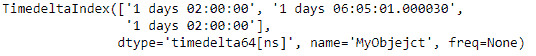
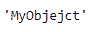
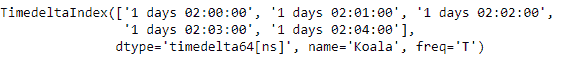
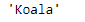

# python \ panda 时针索引。name

> 哎哎哎:# t0]https://www . geeksforgeeks . org/python 熊猫-timedeltaindex-name/

Python 是进行数据分析的优秀语言，主要是因为以数据为中心的 python 包的奇妙生态系统。 ***【熊猫】*** 就是其中一个包，让导入和分析数据变得容易多了。

熊猫 `**TimedeltaIndex.name**`属性返回时间增量索引对象的名称(如果已设置)。如果没有为所考虑的对象设置名称，则返回无。

> **语法:**timedeletendex . name
> 
> **返回:**字符串对象

**示例#1:** 使用`TimedeltaIndex.name`属性找出时间增量索引对象的名称。

```
# importing pandas as pd
import pandas as pd

# Create the TimedeltaIndex object
tidx = pd.TimedeltaIndex(data =['1 days 02:00:00', '1 days 06:05:01.000030',
                                     '1 days 02:00:00'], name ='MyObjejct')

# Print the TimedeltaIndex
print(tidx)
```

**输出:**


现在我们将找出 tidx 对象的名称

```
# print the name of the
# TimedeltaIndex object.
tidx.name
```

**输出:**

在输出中我们可以看到，`TimedeltaIndex.name`属性已经返回了对象的名称。

**例 2:** 使用`TimedeltaIndex.name`属性找出 TimedeltaIndex 对象的名称。

```
# importing pandas as pd
import pandas as pd

# Create the TimedeltaIndex object
tidx = pd.TimedeltaIndex(start ='1 days 02:00:00', periods = 5, 
                                       freq ='T', name ='Koala')

# Print the TimedeltaIndex
print(tidx)
```

**输出:**


现在我们将找出 tidx 对象的名称

```
# print the name of the TimedeltaIndex object.
tidx.name
```

**输出:**

在输出中我们可以看到，`TimedeltaIndex.name`属性已经返回了对象的名称。