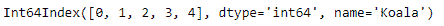
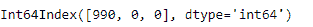

# Python | Pandas 时间增量指数.纳秒

> 原文:[https://www . geesforgeks . org/python-pandas-time deltaindex-纳秒/](https://www.geeksforgeeks.org/python-pandas-timedeltaindex-nanoseconds/)

Python 是进行数据分析的优秀语言，主要是因为以数据为中心的 python 包的奇妙生态系统。 ***【熊猫】*** 就是其中一个包，让导入和分析数据变得容易多了。

Pandas `**TimedeltaIndex.nanoseconds**`属性返回 TimedeltaIndex 对象中每个元素的纳秒数。返回值的范围从 0 到小于 1 微秒。

> **语法:**时间增量索引.纳秒
> 
> **返回:**索引对象

**示例#1:** 使用`TimedeltaIndex.nanoseconds`属性找出时间增量索引对象的每个条目的纳秒值。

```py
# importing pandas as pd
import pandas as pd

# Create the TimedeltaIndex object
tidx = pd.TimedeltaIndex(start ='1 days 02:00:12.001124', periods = 5, 
                                            freq ='N', name ='Koala')

# Print the TimedeltaIndex
print(tidx)
```

**输出:**


现在我们将打印对象每个条目中的纳秒数。

```py
# find nanoseconds number
tidx.nanoseconds
```

**输出:**

正如我们在输出中看到的，`TimedeltaIndex.nanoseconds`属性已经返回了对象中每个元素的纳秒数。

**示例 2:** 使用`TimedeltaIndex.nanoseconds`属性找出 TimedeltaIndex 对象每个条目的纳秒值。

```py
# importing pandas as pd
import pandas as pd

# Create the TimedeltaIndex object
tidx = pd.TimedeltaIndex(data =['-1 days 2 min 3us 10ns', '1 days 06:05:01.000030', 
                                                     '-1 days + 23:59:59.999999'])

# Print the TimedeltaIndex
print(tidx)
```

**输出:**


现在我们将打印对象每个条目中的纳秒数。

```py
# find nanoseconds number
tidx.nanoseconds
```

**输出:**

正如我们在输出中看到的，`TimedeltaIndex.nanoseconds`属性已经返回了对象中每个元素的纳秒数。