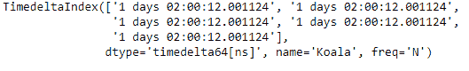
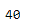
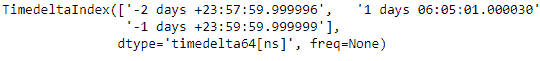
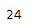

# python | pandas time delta index . nbytes

> 哎哎哎:# t0]https://www . geeksforgeeks . org/python-pandas-time delta index-nbytes/

Python 是进行数据分析的优秀语言，主要是因为以数据为中心的 python 包的奇妙生态系统。 ***【熊猫】*** 就是其中一个包，让导入和分析数据变得容易多了。

Pandas `**TimedeltaIndex.nbytes**`属性返回时间增量索引对象占用的字节数。

> **语法:t1】timedeletendex . nbbytes**
> 
> **返回:**对象的大小(字节)

**示例#1:** 使用`TimedeltaIndex.nbytes`属性找出时间增量索引对象占用的字节数。

```py
# importing pandas as pd
import pandas as pd

# Create the TimedeltaIndex object
tidx = pd.TimedeltaIndex(start ='1 days 02:00:12.001124', periods = 5,
                                             freq ='N', name ='Koala')

# Print the TimedeltaIndex
print(tidx)
```

**输出:**


现在我们将打印 tidx 对象获取的字节数。

```py
# find the size of tidx object in bytes
tidx.nbytes
```

**输出:**

正如我们在输出中看到的，`TimedeltaIndex.nbytes`属性已经返回 40，表示 tidx 对象正在占用这个大小的内存块。

**示例 2:** 使用`TimedeltaIndex.nbytes`属性找出 TimedeltaIndex 对象每个条目的纳秒值。

```py
# importing pandas as pd
import pandas as pd

# Create the TimedeltaIndex object
tidx = pd.TimedeltaIndex(data =['-1 days 2 min 3us 10ns', '1 days 06:05:01.000030',
                                                      '-1 days + 23:59:59.999999'])

# Print the TimedeltaIndex
print(tidx)
```

**输出:**


现在我们将打印 tidx 对象获取的字节数。

```py
# find the size of tidx object in bytes
tidx.nbytes
```

**输出:**

正如我们在输出中看到的，`TimedeltaIndex.nbytes`属性已经返回 24，表示 tidx 对象正在占用这个大小的内存块。