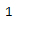

# Python |熊猫时间差指数. ndim

> 哎哎哎:# t0]https://www . geeksforgeeks . org/python-pandas-time delta index-ndim/

Python 是进行数据分析的优秀语言，主要是因为以数据为中心的 python 包的奇妙生态系统。 ***【熊猫】*** 就是其中一个包，让导入和分析数据变得容易多了。

Pandas `**TimedeltaIndex.ndim**`属性返回底层数据的维数，定义为 1。

> **语法:**时间增量索引. ndim
> 
> **返回:**对象的维度

**示例#1:** 使用`TimedeltaIndex.ndim`属性找出给定时间增量索引对象的维度。

```py
# importing pandas as pd
import pandas as pd

# Create the TimedeltaIndex object
tidx = pd.TimedeltaIndex(start ='1 days 02:00:12.001124', periods = 5,
                                             freq ='N', name ='Koala')

# Print the TimedeltaIndex
print(tidx)
```

**输出:**


现在我们将找到 tidx 对象的维度。

```py
# return the dimension of the tidx object
tidx.ndim
```

**输出:**


我们在输出中可以看到，`TimedeltaIndex.ndim`属性已经返回 1，表示 tidx 对象的维度为 1。根据定义，时间增量索引对象的维度是 1。

**示例 2:** 使用`TimedeltaIndex.ndim`属性找出给定时间增量索引对象的维度。

```py
# importing pandas as pd
import pandas as pd

# Create the TimedeltaIndex object
tidx = pd.TimedeltaIndex(data =['-1 days 2 min 3us 10ns', '1 days 06:05:01.000030',
                                                     '-1 days + 23:59:59.999999'])

# Print the TimedeltaIndex
print(tidx)
```

**输出:**


现在我们将找到 tidx 对象的维度。

```py
# return the dimension of the tidx object
tidx.ndim
```

**输出:**

正如我们在输出中看到的，`TimedeltaIndex.ndim`属性已经返回 1，表示 tidx 对象的维度为 1。根据定义，时间增量索引对象的维度是 1。