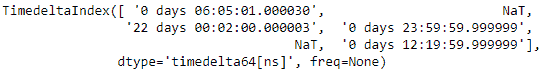
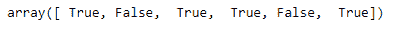
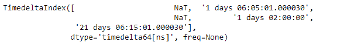
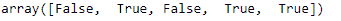

# Python |熊猫时间差指数。注

> 哎哎哎:# t0]https://www . geeksforgeeks . org/python-pandas-time delta index-note na/

Python 是进行数据分析的优秀语言，主要是因为以数据为中心的 python 包的奇妙生态系统。 ***【熊猫】*** 就是其中一个包，让导入和分析数据变得容易多了。

熊猫 `**TimedeltaIndex.notna()**`函数检测给定时间增量索引对象的所有非缺失值。该功能的功能与`TimedeltaIndex.isna()`相反。

> **语法:**时间增量索引. notna()
> 
> **参数:**无
> 
> **返回:**一个布尔数组，表示值是否为非空

**示例#1:** 使用`TimedeltaIndex.notna()`函数检测给定时间增量索引对象中所有未丢失的值。

```py
# importing pandas as pd
import pandas as pd

# Create the TimedeltaIndex object
tidx = pd.TimedeltaIndex(data =['06:05:01.000030', None, '22 day 2 min 3us 10ns',
                                   '+23:59:59.999999', None, '+12:19:59.999999'])

# Print the TimedeltaIndex object
print(tidx)
```

**输出:**


现在我们将使用`TimedeltaIndex.notna()`函数来检测 tidx 对象中所有未丢失的值。

```py
# find all non-missing values
tidx.notna()
```

**输出:**

正如我们在输出中看到的，`TimedeltaIndex.notna()`函数返回了一个布尔数组，其中包含了与非缺失值对应的`True`值和与缺失值对应的`False`值。

**示例 2:** 使用`TimedeltaIndex.notna()`函数检测给定时间增量索引对象中所有未缺失的值。

```py
# importing pandas as pd
import pandas as pd

# Create the TimedeltaIndex object
tidx = pd.TimedeltaIndex(data =[None, '1 days 06:05:01.000030', None,
                       '1 days 02:00:00', '21 days 06:15:01.000030'])

# Print the TimedeltaIndex object
print(tidx)
```

**输出:**

现在我们将使用`TimedeltaIndex.notna()`功能检测 tidx 对象中所有未缺失的值。

```py
# find all non-missing values
tidx.notna()
```

**输出:**

正如我们在输出中看到的，`TimedeltaIndex.notna()`函数返回了一个布尔数组，该数组包含与非缺失值对应的`True`值和与缺失值对应的`False`值。