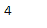
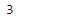

# Python |熊猫时间差指数。决不

> 哎哎哎:# t0]https://www . geeksforgeeks . org/python-pandas-time delta index-nuneme/

Python 是进行数据分析的优秀语言，主要是因为以数据为中心的 python 包的奇妙生态系统。 ***【熊猫】*** 就是其中一个包，让导入和分析数据变得容易多了。

熊猫 `**TimedeltaIndex.nunique()**`函数返回对象中唯一元素的个数。默认情况下，它不包括 NA 值。

> **语法:**时间增量索引. never()
> 
> **参数:**
> **dropna :** 不要把 NaN 算在内
> 
> **返回:**从不:int

**示例#1:** 使用`TimedeltaIndex.nunique()`函数查找给定时间增量索引对象中唯一值的数量。

```py
# importing pandas as pd
import pandas as pd

# Create the TimedeltaIndex object
tidx = pd.TimedeltaIndex(data =['06:05:01.000030', None, '22 day 2 min 3us 10ns', 
                                   '+23:59:59.999999', None, '+12:19:59.999999'])

# Print the TimedeltaIndex object
print(tidx)
```

**输出:**


现在我们将使用`TimedeltaIndex.nunique()`函数来查找 tidx 对象中唯一值的数量。

```py
# find the number of unique values
# in the tidx object.
tidx.nunique()
```

**输出:**

正如我们在输出中看到的，`TimedeltaIndex.nunique()`函数已经返回了 tidx 对象中唯一值的总数。

**示例 2:** 使用`TimedeltaIndex.nunique()`函数查找给定时间增量索引对象中唯一值的数量。

```py
# importing pandas as pd
import pandas as pd

# Create the TimedeltaIndex object
tidx = pd.TimedeltaIndex(data =[None, '1 days 06:05:01.000030', None,
                       '1 days 02:00:00', '21 days 06:15:01.000030'])

# Print the TimedeltaIndex object
print(tidx)
```

**输出:**

现在我们将使用`TimedeltaIndex.nunique()`函数来查找 tidx 对象中唯一值的数量。

```py
# find the number of unique values 
# in the tidx object.
tidx.nunique()
```

**输出:**

正如我们在输出中看到的，`TimedeltaIndex.nunique()`函数已经返回了 tidx 对象中唯一值的总数。