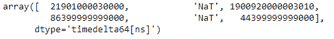
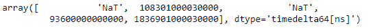

# Python |熊猫时间差指数. ravel

> 哎哎哎:# t0]https://www . geeksforgeeks . org/python 熊猫-timedeltaindex-ravel/

Python 是进行数据分析的优秀语言，主要是因为以数据为中心的 python 包的奇妙生态系统。 ***【熊猫】*** 就是其中一个包，让导入和分析数据变得容易多了。

熊猫 `**TimedeltaIndex.ravel()**`函数返回时间增量索引对象的底层数据的展平值的数组。

> **语法:**时标索引. ravel()
> 
> **参数:**无
> 
> **返回:**ndaarray

**示例#1:** 使用`TimedeltaIndex.ravel()`函数返回给定时间增量索引对象的数组。

```
# importing pandas as pd
import pandas as pd

# Create the TimedeltaIndex object
tidx=pd.TimedeltaIndex(data=['06:05:01.000030', None, '22 day 2 min 3us 10ns', 
                                  '+23:59:59.999999',None,'+12:19:59.999999'])

# Print the TimedeltaIndex object
print(tidx)
```

**输出:**


现在我们将使用`TimedeltaIndex.ravel()`函数返回 tidx 对象的一个数组。

```
# return an ndarray
tidx.ravel()
```

**输出:**

正如我们在输出中看到的，`TimedeltaIndex.ravel()`函数已经返回了给定时间增量索引对象中底层数据的数组。

**示例 2:** 使用`TimedeltaIndex.ravel()`函数返回给定时间增量索引对象的数组。

```
# importing pandas as pd
import pandas as pd

# Create the TimedeltaIndex object
tidx=pd.TimedeltaIndex(data=[None,'1 days 06:05:01.000030',None,
                   '1 days 02:00:00','21 days 06:15:01.000030'])

# Print the TimedeltaIndex object
print(tidx)
```

**输出:**


现在我们将使用`TimedeltaIndex.ravel()`函数返回 tidx 对象的一个数组。

```
# return an ndarray
tidx.ravel()
```

**输出:**


正如我们在输出中看到的那样，`TimedeltaIndex.ravel()`函数已经返回了给定时间增量索引对象中底层数据的数组。