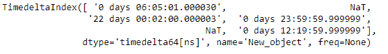
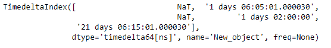

# Python | Pandas 时间增量索引. rename

> 原文:[https://www . geesforgeks . org/python-pandas-time deltaindex-rename/](https://www.geeksforgeeks.org/python-pandas-timedeltaindex-rename/)

Python 是进行数据分析的优秀语言，主要是因为以数据为中心的 python 包的奇妙生态系统。 ***【熊猫】*** 就是其中一个包，让导入和分析数据变得容易多了。

熊猫 `**TimedeltaIndex.rename()**`功能在索引上设置新名字。它默认返回新索引。

> **语法:**时间增量索引.重命名(名称，inplace=False)
> 
> **参数:**无
> **名称:**【字符串或列表】名称将
> **设置在原位:**如果为真，则原地突变
> 
> **返回:**新索引(相同类型和类别…等)【如果在原地，返回无】

**示例#1:** 使用`TimedeltaIndex.rename()`函数重命名给定的时间增量索引对象。

```py
# importing pandas as pd
import pandas as pd

# Create the TimedeltaIndex object
tidx = pd.TimedeltaIndex(data =['06:05:01.000030', None, '22 day 2 min 3us 10ns',
                      '+23:59:59.999999', None, '+12:19:59.999999'], name ='Old')

# Print the TimedeltaIndex object
print(tidx)
```

**输出:**


现在我们将使用`TimedeltaIndex.rename()`函数来重命名 tidx 对象。

```py
# rename the tidx object
tidx.rename(name ='New_object')
```

**输出:**



正如我们在输出中看到的那样，`TimedeltaIndex.rename()`函数返回了一个新的索引，并设置了 TimedeltaIndex 对象的名称属性。

**示例 2:** 使用`TimedeltaIndex.rename()`函数重命名给定的时间增量索引对象。

```py
# importing pandas as pd
import pandas as pd

# Create the TimedeltaIndex object
tidx = pd.TimedeltaIndex(data =[None, '1 days 06:05:01.000030', None, '1 days 02:00:00',
                                         '21 days 06:15:01.000030'], name ='Old_object')

# Print the TimedeltaIndex object
print(tidx)
```

**输出:**


现在我们将使用`TimedeltaIndex.rename()`函数来重命名 tidx 对象。

```py
# rename the tidx object
tidx.rename(name ='New_object')
```

**输出:**



正如我们在输出中看到的那样，`TimedeltaIndex.rename()`函数返回了一个新的索引，并设置了 TimedeltaIndex 对象的名称属性。