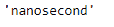
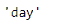

# 蟒蛇|熊猫时间增量索引.分辨率

> 原文:[https://www . geesforgeks . org/python-pandas-time deltaindex-resolution/](https://www.geeksforgeeks.org/python-pandas-timedeltaindex-resolution/)

Python 是进行数据分析的优秀语言，主要是因为以数据为中心的 python 包的奇妙生态系统。 ***【熊猫】*** 就是其中一个包，让导入和分析数据变得容易多了。

Pandas `**TimedeltaIndex.resolution**`属性返回一个字符串，代表给定时间增量索引对象的最低分辨率。

> **语法:**时间增量索引.分辨率
> 
> **返回:**字符串

**示例#1:** 使用`TimedeltaIndex.resolution`属性找出给定对象可用的最低分辨率。

```
# importing pandas as pd
import pandas as pd

# Create the TimedeltaIndex object
tidx = pd.TimedeltaIndex(start ='1 days 02:00:12.001124', periods = 5,
                                            freq ='N', name ='Koala')

# Print the TimedeltaIndex
print(tidx)
```

**输出:**


现在我们将找到给定对象的最低分辨率。

```
# return the lowest resolution available for the tidx object
tidx.resolution
```

**输出:**

正如我们在输出中看到的，`TimedeltaIndex.resolution`属性返回了“纳秒”作为给定 tidx 对象可用的最低分辨率。

**示例 2:** 使用`TimedeltaIndex.resolution`属性找出给定对象可用的最低分辨率。

```
# importing pandas as pd
import pandas as pd

# Create the TimedeltaIndex object
tidx = pd.TimedeltaIndex(data =['-1 days 2 min 3us 10ns', '1 days 06:05:01.000030',
                                                      '-1 days + 23:59:59.999999'])

# Print the TimedeltaIndex
print(tidx)
```

**输出:**


现在我们将找到给定对象的最低分辨率。

```
# return the lowest resolution available for the tidx object
tidx.resolution
```

**输出:**

正如我们在输出中看到的，`TimedeltaIndex.resolution`属性已经返回“天”作为给定 tidx 对象可用的最低分辨率。