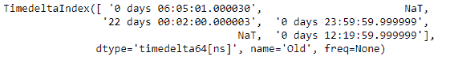
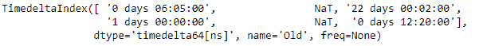
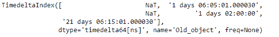
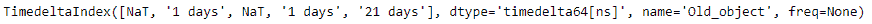

# Python |熊猫时间差指数. round

> 原文:[https://www . geesforgeks . org/python-pandas-time deltaindex-round/](https://www.geeksforgeeks.org/python-pandas-timedeltaindex-round/)

Python 是进行数据分析的优秀语言，主要是因为以数据为中心的 python 包的奇妙生态系统。 ***【熊猫】*** 就是其中一个包，让导入和分析数据变得容易多了。

Pandas `**TimedeltaIndex.round()**`函数将给定时间增量索引对象的标签舍入到指定的频率。

> **语法:** TimedeltaIndex.round(freq，*args，**kwargs)
> 
> **参数:**
> **freq :** freq 字符串/对象
> 
> **返回:**同类型索引

**示例#1:** 使用`TimedeltaIndex.round()`函数舍入给定时间增量索引对象的标签。

```
# importing pandas as pd
import pandas as pd

# Create the TimedeltaIndex object
tidx = pd.TimedeltaIndex(data =['06:05:01.000030', None, '22 day 2 min 3us 10ns',
                     '+23:59:59.999999', None, '+12:19:59.999999'], name ='Old')

# Print the TimedeltaIndex object
print(tidx)
```

**输出:**


现在我们将使用`TimedeltaIndex.round()`函数将 tidx 对象的标签舍入到微小的频率。

```
# round the labels of the tidx
# object to minutely frequency
tidx.round('T')
```

**输出:**

正如我们在输出中看到的，`TimedeltaIndex.round()`函数已经将给定时间增量索引对象的值舍入到所需的频率。

**示例 2:** 使用`TimedeltaIndex.round()`函数重命名给定的时间增量索引对象。

```
# importing pandas as pd
import pandas as pd

# Create the TimedeltaIndex object
tidx = pd.TimedeltaIndex(data =[None, '1 days 06:05:01.000030', None,
                                '1 days 02:00:00', '21 days 06:15:01.000030'],
                                                           name ='Old_object')

# Print the TimedeltaIndex object
print(tidx)
```

**输出:**



现在我们将使用`TimedeltaIndex.round()`功能将 tidx 对象的标签舍入到每日频率。

```
# round the labels of the tidx 
# object to daily frequency
tidx.round('D')
```

**输出:**


正如我们在输出中看到的那样，`TimedeltaIndex.round()`函数已经将给定时间增量索引对象的值舍入到所需的频率。