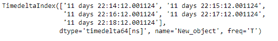
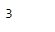
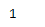

# Python | Pandas time deltaindex . search sorted

> 原文:[https://www . geesforgeks . org/python-pandas-time deltaindex-search sorted/](https://www.geeksforgeeks.org/python-pandas-timedeltaindex-searchsorted/)

Python 是进行数据分析的优秀语言，主要是因为以数据为中心的 python 包的奇妙生态系统。 ***【熊猫】*** 就是其中一个包，让导入和分析数据变得容易多了。

熊猫 `**TimedeltaIndex.searchsorted()**`函数找到元素应该插入的索引，以维持秩序。在排序的时间增量索引自身中查找索引，这样，如果在索引之前插入了相应的值元素，则自身的顺序将被保留。

> **语法:** TimedeltaIndex.searchsorted(值，边= '左'，排序器=无)
> 
> **参数:**
> **值:**【阵 _ 象】值插入自我。
> **边:**如果‘左’，给出找到的第一个合适位置的索引。如果“正确”，返回最后一个这样的索引。如果没有合适的索引，返回 0 或 N(其中 N 是 self 的长度)
> **排序器:**将 self 按升序排序的可选整数索引数组。它们通常是 np.argsort 的结果。
> 
> **返回:**与值形状相同的插入点数组。

**示例#1:** 使用`TimedeltaIndex.searchsorted()`函数查找应该插入元素的索引，以保持给定时间增量索引对象中的顺序。

```
# importing pandas as pd
import pandas as pd

# Create the TimedeltaIndex object
tidx = pd.TimedeltaIndex(start ='11 days 22:14:12.001124', periods = 5, 
                                         freq ='T', name ='New_object')

# Print the TimedeltaIndex object
print(tidx)
```

**输出:**


现在我们将使用`TimedeltaIndex.searchsorted()`函数来查找索引的值，在该索引中应该插入给定的元素，以保持给定对象中的顺序。

```
# return the value of index
tidx.searchsorted('11 days 22:16:13.001124')
```

**输出:**


正如我们在输出中看到的那样，`TimedeltaIndex.searchsorted()`函数返回了 3，表明这是应该插入传递的值的地方，以保持给定时间增量索引对象中的顺序。

**示例#2:** 使用`TimedeltaIndex.searchsorted()`函数查找应该插入元素的索引，以保持给定时间增量索引对象中的顺序。

```
# importing pandas as pd
import pandas as pd

# Create the TimedeltaIndex object
tidx = pd.TimedeltaIndex(start ='03 days 09:22:56', periods = 5,
                                  freq ='H', name ='New_object')

# Print the TimedeltaIndex object
print(tidx)
```

**输出:**


现在我们将使用`TimedeltaIndex.searchsorted()`函数来查找索引的值，在该索引中应该插入给定的元素，以保持给定对象中的顺序。

```
# return the value of index
tidx.searchsorted('3 days 09:45:56')
```

**输出:**

正如我们在输出中看到的，`TimedeltaIndex.searchsorted()`函数返回了 3，表示这是应该插入传递值的地方