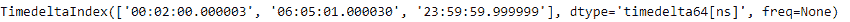
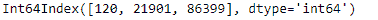
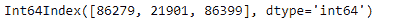

# Python |熊猫时间差指数。秒

> 原文:[https://www . geesforgeks . org/python-pandas-time deltaindex-seconds/](https://www.geeksforgeeks.org/python-pandas-timedeltaindex-seconds/)

Python 是进行数据分析的优秀语言，主要是因为以数据为中心的 python 包的奇妙生态系统。 ***【熊猫】*** 就是其中一个包，让导入和分析数据变得容易多了。

熊猫 `**TimedeltaIndex.seconds**`属性返回时间增量索引对象中每个元素的秒数。返回值的范围从 0 到小于 1 天。

> **语法:**时间增量索引.秒
> 
> **返回:**索引对象

**示例#1:** 使用`TimedeltaIndex.seconds`属性找出时间增量索引对象的每个条目的秒值。

```py
# importing pandas as pd
import pandas as pd

# Create the TimedeltaIndex object
tidx = pd.TimedeltaIndex(data =['2 min 3us 10ns', '06:05:01.000030',
                                               '+23:59:59.999999'])

# Print the TimedeltaIndex
print(tidx)
```

**输出:**


现在我们将打印对象每个条目中的秒数。

```py
# find number of seconds for each element
tidx.seconds
```

**输出:**

正如我们在输出中看到的，`TimedeltaIndex.seconds`属性已经返回了对象中每个元素的秒数。

**示例 2:** 使用`TimedeltaIndex.seconds`属性找出 TimedeltaIndex 对象每个条目的秒值。

```py
# importing pandas as pd
import pandas as pd

# Create the TimedeltaIndex object
tidx = pd.TimedeltaIndex(data =['-1 days 2 min 3us 10ns', '1 days 06:05:01.000030',
                                                     '-1 days + 23:59:59.999999'])

# Print the TimedeltaIndex
print(tidx)
```

**输出:**


现在我们将打印对象每个条目中的秒数。

```py
# find number of seconds for each element
tidx.seconds
```

**输出:**

在输出中我们可以看到，`TimedeltaIndex.seconds`属性已经返回了对象每个元素的秒数。