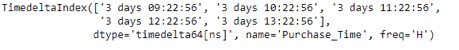

# 蟒蛇|熊猫时间增量索引. set _ name

> 原文:[https://www . geesforgeks . org/python-pandas-time deltaindex-set _ names/](https://www.geeksforgeeks.org/python-pandas-timedeltaindex-set_names/)

Python 是进行数据分析的优秀语言，主要是因为以数据为中心的 python 包的奇妙生态系统。 ***【熊猫】*** 就是其中一个包，让导入和分析数据变得容易多了。

熊猫 `**TimedeltaIndex.set_names()**`功能用于在给定的时间增量索引对象上设置新名称。该函数默认返回新的索引对象。

> **语法:**时间增量索引. _ names(名称，级别=无，位置=假)
> 
> **参数:**
> **名称:**名称设置
> **级别:**如果索引是多索引(分层)，级别设置(所有级别均为无)。否则等级必须为无
> **在原地:**如果为真，在原地变异
> 
> **返回:**新索引(相同类型和类别…等)【如果在原地，返回无】

**示例#1:** 使用`TimedeltaIndex.set_names()`函数设置给定时间增量索引对象的名称。

```py
# importing pandas as pd
import pandas as pd

# Create the TimedeltaIndex object
tidx = pd.TimedeltaIndex(start ='11 days 22:14:12.001124', periods = 5, freq ='T')

# Print the TimedeltaIndex object
print(tidx)
```

**输出:**


现在我们将使用`TimedeltaIndex.set_names()`函数来设置给定时间增量索引对象的名称。

```py
# set the name of the object
tidx.set_names(names ='Sale_Point')
```

**输出:**


我们可以在输出中看到，`TimedeltaIndex.set_names()`函数返回了一个新的对象，并且还设置了返回对象的名称。

**示例 2:** 使用`TimedeltaIndex.set_names()`函数设置给定时间增量索引对象的名称。

```py
# importing pandas as pd
import pandas as pd

# Create the TimedeltaIndex object
tidx = pd.TimedeltaIndex(start ='03 days 09:22:56', periods = 5, freq ='H')

# Print the TimedeltaIndex object
print(tidx)
```

**输出:**


现在我们将使用`TimedeltaIndex.set_names()`函数来设置给定时间增量索引对象的名称。

```py
# set the name of the object
tidx.set_names(names ='Purchase_Time')
```

**输出:**

正如我们在输出中看到的，`TimedeltaIndex.set_names()`函数返回了一个新的对象，并且还设置了返回对象的名称。