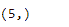
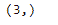

# Python |熊猫时间增量指数. shape

> 原文:[https://www . geesforgeks . org/python-pandas-time deltaindex-shape/](https://www.geeksforgeeks.org/python-pandas-timedeltaindex-shape/)

Python 是进行数据分析的优秀语言，主要是因为以数据为中心的 python 包的奇妙生态系统。 ***【熊猫】*** 就是其中一个包，让导入和分析数据变得容易多了。

Pandas `**TimedeltaIndex.shape**`属性返回所考虑对象中存在的底层数据形状的元组。

> **语法:t1】timedeletendex . shape**
> 
> **返回:**形状

**示例#1:** 使用`TimedeltaIndex.shape`属性找出给定对象中底层数据的形状。

```py
# importing pandas as pd
import pandas as pd

# Create the TimedeltaIndex object
tidx = pd.TimedeltaIndex(start ='1 days 02:00:12.001124', periods = 5,
                                             freq ='N', name ='Koala')

# Print the TimedeltaIndex
print(tidx)
```

**输出:**


现在我们将找出给定物体的形状。

```py
# print the shape of the tidx object
tidx.shape
```

**输出:**

正如我们在输出中看到的，`TimedeltaIndex.shape`属性已经返回了(5)，这是 tidx 对象底层数据的形状。

**例 2:** 使用`TimedeltaIndex.shape`属性找出给定对象中底层数据的形状。

```py
# importing pandas as pd
import pandas as pd

# Create the TimedeltaIndex object
tidx = pd.TimedeltaIndex(data =['-1 days 2 min 3us 10ns', '1 days 06:05:01.000030',
                                                      '-1 days + 23:59:59.999999'])

# Print the TimedeltaIndex
print(tidx)
```

**输出:**


现在我们将找出给定物体的形状。

```py
# print the shape of the tidx object
tidx.shape
```

**输出:**

正如我们在输出中看到的，`TimedeltaIndex.shape`属性已经返回了(3)，这是 tidx 对象底层数据的形状。