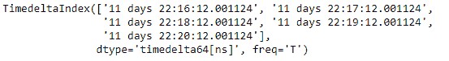
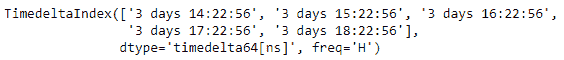

# python | pandas time delta index . shift()

> 哎哎哎:# t0]https://www . geeksforgeeks . org/python-pandas-time delta index-shift/

Python 是进行数据分析的优秀语言，主要是因为以数据为中心的 python 包的奇妙生态系统。 ***【熊猫】*** 就是其中一个包，让导入和分析数据变得容易多了。

熊猫 `**TimedeltaIndex.shift()**`函数对给定的时间增量索引对象执行专门的移位，从而产生一个日期时间索引对象。

> **语法:**时间增量索引移位(n，freq =无)
> 
> **参数:**
> **n :** 周期移动
> **频率:**日期偏移或类似时间增量，可选
> 
> **返回:**移位:日期时间索引

**示例#1:** 使用`TimedeltaIndex.shift()`函数将给定的时间增量索引对象移动 2 个周期。

```py
# importing pandas as pd
import pandas as pd

# Create the TimedeltaIndex object
tidx = pd.TimedeltaIndex(start ='11 days 22:14:12.001124',
                                   periods = 5, freq ='T')

# Print the TimedeltaIndex object
print(tidx)
```

**输出:**


现在我们将使用`TimedeltaIndex.shift()`函数将给定时间增量索引对象的每个元素移动 2 个周期。

```py
# shift by 2 periods
tidx.shift(n = 2)
```

**输出:**


正如我们在输出中看到的那样，`TimedeltaIndex.shift()`函数返回了一个新的对象，并且它将每个元素移动了 2 分钟。

**示例#2:** 使用`TimedeltaIndex.shift()`函数将给定的时间增量索引对象移动 2 个周期。

```py
# importing pandas as pd
import pandas as pd

# Create the TimedeltaIndex object
tidx = pd.TimedeltaIndex(start ='03 days 09:22:56',
                            periods = 5, freq ='H')

# Print the TimedeltaIndex object
print(tidx)
```

**输出:**


现在我们将使用`TimedeltaIndex.shift()`函数将给定时间增量索引对象的每个元素移动 5 个周期。

```py
# shift by 5 periods
tidx.shift(n = 5)
```

**输出:**



正如我们在输出中看到的那样，`TimedeltaIndex.shift()`函数返回了一个新的对象，并且将每个元素移动了 5 个小时。