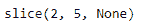

# Python | Pandas time delta index . slice _ indexer

> 原文:[https://www . geesforgeks . org/python-pandas-time deltaindex-slice _ indexer/](https://www.geeksforgeeks.org/python-pandas-timedeltaindex-slice_indexer/)

Python 是进行数据分析的优秀语言，主要是因为以数据为中心的 python 包的奇妙生态系统。 ***【熊猫】*** 就是其中一个包，让导入和分析数据变得容易多了。

熊猫 `**TimedeltaIndex.slice_indexer()**`函数计算输入标签的切片索引器和有序时间增量索引对象的步长。该函数假设数据已排序。

> **语法:**time delta index . slice _ indexer(开始=无，结束=无，步骤=无，种类=无)
> 
> **参数:**
> **开始:**如果无，默认开始
> **结束:**如果无，默认结束
> **步骤:** int，默认无
> **种类:** string，默认无
> 
> **返回:**索引器:数组或切片

**示例#1:** 使用`TimedeltaIndex.slice_indexer()`函数计算给定时间增量索引对象中传递的标签的切片索引器。

```
# importing pandas as pd
import pandas as pd

# Create the TimedeltaIndex object
tidx = pd.TimedeltaIndex(start ='11 days 22:14:12.001124',
                                   periods = 5, freq ='T')

# Print the TimedeltaIndex object
print(tidx)
```

**输出:**


现在我们将使用`TimedeltaIndex.slice_indexer()`函数为传递的标签找到切片值。

```
# find the slice indexer
tidx.slice_indexer('11 days 22:15:20.001124')
```

**输出:**



正如我们在输出中看到的那样，`TimedeltaIndex.slice_indexer()`函数已经返回了 tidx 对象中元素的位置和数量。

**示例 2:** 使用`TimedeltaIndex.slice_indexer()`函数计算给定时间增量索引对象中传递的标签的切片索引器。

```
# importing pandas as pd
import pandas as pd

# Create the TimedeltaIndex object
tidx = pd.TimedeltaIndex(start ='03 days 09:22:56',
                            periods = 5, freq ='H')

# Print the TimedeltaIndex object
print(tidx)
```

**输出:**


现在我们将使用`TimedeltaIndex.slice_indexer()`函数为传递的标签找到切片值。

```
# find the slice indexer
tidx.slice_indexer('3 days 12:20:56')
```

**输出:**

正如我们在输出中看到的，`TimedeltaIndex.slice_indexer()`函数已经返回了 tidx 对象中元素的位置和数量。