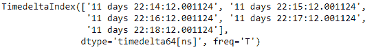
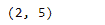
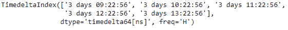
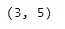

# python | pandas time delta index . slice _ locs()

> 原文:[https://www . geesforgeks . org/python-pandas-time delta index-slice _ locs/](https://www.geeksforgeeks.org/python-pandas-timedeltaindex-slice_locs/)

Python 是进行数据分析的优秀语言，主要是因为以数据为中心的 python 包的奇妙生态系统。 ***【熊猫】*** 就是其中一个包，让导入和分析数据变得容易多了。

熊猫 `**TimedeltaIndex.slice_locs()**`函数计算输入标签的切片位置，并步进一个有序的时间增量索引对象。该函数假设数据已排序。

> **语法:**时间增量索引切片位置(开始=无，结束=无，步骤=无，种类=无)
> 
> **参数:**
> **开始:**(标签，默认无)如果无，默认开始
> **结束:**(标签，默认无)如果无，默认结束
> **步骤:** (int，默认无)如果无，默认 1
> **种类:** {'ix '，' loc '，' getitem'}或无
> 
> **返回:**开始，结束:int

**示例#1:** 使用`TimedeltaIndex.slice_locs()`函数计算给定时间增量索引对象中传递的标签的切片位置。

```
# importing pandas as pd
import pandas as pd

# Create the TimedeltaIndex object
tidx = pd.TimedeltaIndex(start ='11 days 22:14:12.001124', periods = 5, freq ='T')

# Print the TimedeltaIndex object
print(tidx)
```

**输出:**


现在我们将使用`TimedeltaIndex.slice_locs()`函数为传递的标签找到切片位置值。

```
# # find the slice location for the passed label
tidx.slice_locs('11 days 22:15:20.001124')
```

**输出:**


正如我们在输出中看到的那样，`TimedeltaIndex.slice_locs()`函数已经返回了 tidx 对象中切片的开始位置和结束位置。

**示例 2:** 使用`TimedeltaIndex.slice_locs()`函数计算给定时间增量索引对象中传递的标签的切片位置。

```
# importing pandas as pd
import pandas as pd

# Create the TimedeltaIndex object
tidx = pd.TimedeltaIndex(start ='03 days 09:22:56', periods = 5, freq ='H')

# Print the TimedeltaIndex object
print(tidx)
```

**输出:**


现在我们将使用`TimedeltaIndex.slice_locs()`函数为传递的标签找到切片位置值。

```
# find the slice location for the passed label
tidx.slice_locs('3 days 12:20:56')
```

**输出:**

正如我们在输出中看到的，`TimedeltaIndex.slice_locs`函数已经返回了 tidx 对象中切片的开始位置和结束位置。