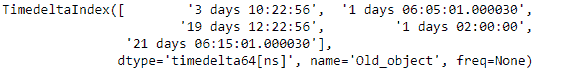
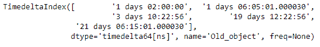
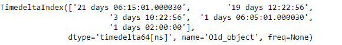

# Python | Pandas 时间增量索引. sort_values

> 原文:[https://www . geesforgeks . org/python-pandas-time deltaindex-sort _ values/](https://www.geeksforgeeks.org/python-pandas-timedeltaindex-sort_values/)

Python 是进行数据分析的优秀语言，主要是因为以数据为中心的 python 包的奇妙生态系统。 ***【熊猫】*** 就是其中一个包，让导入和分析数据变得容易多了。

熊猫 `**TimedeltaIndex.sort_values()**`函数返回给定时间增量索引对象的排序副本。

> **语法:**时间增量索引.排序 _ 值(return _ indexer =假，升序=真)
> 
> **参数:**
> **上升:**决定顺序
> 
> **返回:**同类型对象

**示例#1:** 使用`TimedeltaIndex.sort_values()`函数以升序对给定的时间增量索引对象进行排序。

```
# importing pandas as pd
import pandas as pd

# Create the TimedeltaIndex object
tidx = pd.TimedeltaIndex(data =['3 days 10:22:56', '1 days 06:05:01.000030',
                                   '19 days 12:22:56', '1 days 02:00:00',
                           '21 days 06:15:01.000030'], name ='Old_object')

# Print the TimedeltaIndex object
print(tidx)
```

**输出:**

现在我们使用`TimedeltaIndex.sort_values()`功能对 tidx 对象进行排序。

```
# sort the values in the given 
# object in ascending order
tidx.sort_values()
```

**输出:**


正如我们在输出中看到的那样，`TimedeltaIndex.sort_values()`函数返回了一个按升序排序的对象。

**示例 2:** 使用`TimedeltaIndex.sort_values()`函数按降序对给定的时间增量索引对象进行排序。

```
# importing pandas as pd
import pandas as pd

# Create the TimedeltaIndex object
tidx = pd.TimedeltaIndex(data =['3 days 10:22:56', '1 days 06:05:01.000030',
                             '19 days 12:22:56', '1 days 02:00:00',
                           '21 days 06:15:01.000030'], name ='Old_object')

# Print the TimedeltaIndex object
print(tidx)
```

**输出:**


现在我们将使用`TimedeltaIndex.sort_values()`函数对 tidx 对象进行排序。

```
# sort the values in the given object in descending order
tidx.sort_values(ascending = False)
```

**输出:**



正如我们在输出中看到的那样，`TimedeltaIndex.sort_values()`函数返回了一个按降序排序的对象。