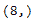

# python \ panda 时针索引。strings

> 原文:[https://www . geesforgeks . org/python-pandas-time delta index-strips/](https://www.geeksforgeeks.org/python-pandas-timedeltaindex-strides/)

Python 是进行数据分析的优秀语言，主要是因为以数据为中心的 python 包的奇妙生态系统。 ***【熊猫】*** 就是其中一个包，让导入和分析数据变得容易多了。

熊猫 `**TimedeltaIndex.strides**`属性返回所考虑的底层数据的步长。TimedeltaIndex 对象的步长告诉我们，要移动到下一个位置，我们必须在内存中跳过多少字节。

> **语法:T1】时时刻刻索引。strings**
> 
> **返回:**步幅值

**示例#1:** 使用`TimedeltaIndex.strides`属性找出给定时间增量索引对象的步长。

```
# importing pandas as pd
import pandas as pd

# Create the TimedeltaIndex object
tidx = pd.TimedeltaIndex(start ='1 days 02:00:12.001124', periods = 5, 
                                             freq ='N', name ='Koala')

# Print the TimedeltaIndex
print(tidx)
```

**输出:**


现在我们将找出 idx 对象的跨步值。

```
# print the strides for tidx object
tidx.strides
```

**输出:**

正如我们在输出中看到的，`TimedeltaIndex.strides`属性返回了 8，因为给定对象中存储的数据类型是“timedelta64[ns]”。

**示例 2:** 使用`TimedeltaIndex.strides`属性找出给定时间增量索引对象的步长。

```
# importing pandas as pd
import pandas as pd

# Create the TimedeltaIndex object
tidx = pd.TimedeltaIndex(data =['-1 days 2 min 3us 10ns', '1 days 06:05:01.000030',
                                                      '-1 days + 23:59:59.999999'])

# Print the TimedeltaIndex
print(tidx)
```

**输出:**


现在我们将找出 idx 对象的跨步值。

```
# print the strides for tidx object
tidx.strides
```

**输出:**

正如我们在输出中看到的，`TimedeltaIndex.strides`属性返回了 8，因为给定对象中存储的数据类型是‘time delta 64[ns]’。