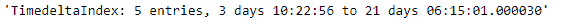
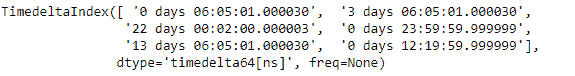
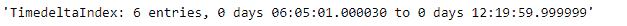

# python | pandas time delta index . summary()

> 原文:[https://www . geesforgeks . org/python-pandas-time deltaindex-summary/](https://www.geeksforgeeks.org/python-pandas-timedeltaindex-summary/)

Python 是进行数据分析的优秀语言，主要是因为以数据为中心的 python 包的奇妙生态系统。 ***【熊猫】*** 就是其中一个包，让导入和分析数据变得容易多了。

熊猫 `**TimedeltaIndex.summary()**`函数返回给定时间增量索引对象的汇总表示。摘要包含条目总数、第一个条目和最后一个条目

> **语法:**时间增量索引.摘要(值=无)
> 
> **参数:**
> 值:用于填充孔洞的标量值(例如 0)。该值不能是喜欢的列表。
> 
> **退货:**汇总

**示例#1:** 使用`TimedeltaIndex.summary()`函数查找给定时间增量索引对象的摘要。

```
# importing pandas as pd
import pandas as pd

# Create the TimedeltaIndex object
tidx = pd.TimedeltaIndex(data =['3 days 10:22:56', '1 days 06:05:01.000030',
                        '19 days 12:22:56','1 days 02:00:00', 
                        '21 days 06:15:01.000030'],name ='Old_object')

# Print the TimedeltaIndex object
print(tidx)
```

**输出:**


现在我们将使用`TimedeltaIndex.summary()`函数返回 tidx 对象的摘要。

```
# find summary of tidx
tidx.summary()
```

**输出:**


正如我们在输出中看到的那样，`TimedeltaIndex.summary()`函数返回了给定时间增量索引对象的完整摘要。

**示例 2:** 使用`TimedeltaIndex.summary()`函数查找给定时间增量索引对象的摘要。

```
# importing pandas as pd
import pandas as pd

# Create the TimedeltaIndex object
tidx = pd.TimedeltaIndex(data =['06:05:01.000030', '3 days 06:05:01.000030', 
                        '22 day 2 min 3us 10ns', '+23:59:59.999999',
                        '13 days 06:05:01.000030', '+12:19:59.999999'])

# Print the TimedeltaIndex object
print(tidx)
```

**输出:**


现在我们将使用`TimedeltaIndex.summary()`函数返回 tidx 对象的摘要。

```
# find summary of tidx
tidx.summary()
```

**输出:**


正如我们在输出中看到的那样，`TimedeltaIndex.summary()`函数返回了给定时间增量索引对象的完整摘要。