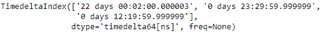
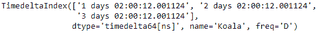

# python \ panda 时针索引. take()

> 原文:[https://www . geesforgeks . org/python-pandas-time deltaindex-take/](https://www.geeksforgeeks.org/python-pandas-timedeltaindex-take/)

Python 是进行数据分析的优秀语言，主要是因为以数据为中心的 python 包的奇妙生态系统。 ***【熊猫】*** 就是其中一个包，让导入和分析数据变得容易多了。

熊猫 `**TimedeltaIndex.take()**`函数返回由索引选择的值的新索引。我们通常会传递一个要采用的指数列表。它用于与 numpy 数组的内部兼容。

> **语法:**时间增量索引获取(索引，轴=0，允许 _ 填充=真，填充 _ 值=无，**kwargs)
> 
> **参数:**
> **指数:**列出要获取的指数
> **轴:**选择数值的轴，始终为 0。
> **allow_fill :** bool，默认 True
> **fill_value:**bool，默认 None，如果 allow_fill=True 且 fill _ value 不是 None，则-1 指定的索引视为 NA。如果指数不持有 NA，则提高值错误
> 
> **返回:**同类型对象

**示例#1:** 使用`TimedeltaIndex.take()`函数返回一个只包含选定值的新的时间增量索引对象。

```py
# importing pandas as pd
import pandas as pd

# Create the TimedeltaIndex object
tidx = pd.TimedeltaIndex(data =['06:05:01.000030', '+23:59:59.999999', 
                        '22 day 2 min 3us 10ns', '+23:29:59.999999', 
                        '+12:19:59.999999'])

# Print the TimedeltaIndex object
print(tidx)
```

**输出:**


现在我们将使用`TimedeltaIndex.take()`功能从 tidx 中选择一些特定的值。

```py
# select specific values.
tidx.take([2, 3, 4])
```

**输出:**


正如我们在输出中看到的那样，`TimedeltaIndex.take()`函数返回了一个新的 TimedeltaIndex 对象，该对象只包含那些位置已经被传递给该函数的元素。

**示例 2:** 使用`TimedeltaIndex.take()`函数返回一个只包含选定值的新的时间增量索引对象。

```py
# importing pandas as pd
import pandas as pd

# Create the TimedeltaIndex object
tidx = pd.TimedeltaIndex(start ='1 days 02:00:12.001124', 
                         periods = 5, freq ='D', name ='Koala')

# Print the TimedeltaIndex object
tidx
```

**输出:**


现在我们将使用`TimedeltaIndex.take()`功能从 tidx 中选择一些特定的值。

```py
# select specific values.
tidx.take([0, 1, 2])
```

**输出:**

正如我们在输出中看到的，`TimedeltaIndex.take()`函数返回了一个新的 TimedeltaIndex 对象，该对象只包含那些位置已经传递给函数的元素。