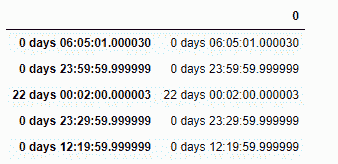
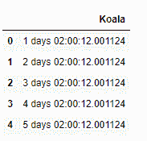

# Python | Pandas time delta index . to _ frame()

> 原文:[https://www . geesforgeks . org/python-pandas-time deltaindex-to _ frame/](https://www.geeksforgeeks.org/python-pandas-timedeltaindex-to_frame/)

Python 是进行数据分析的优秀语言，主要是因为以数据为中心的 python 包的奇妙生态系统。 ***【熊猫】*** 就是其中一个包，让导入和分析数据变得容易多了。

熊猫 `**TimedeltaIndex.to_frame()**`函数从给定的时间增量索引对象创建一个数据帧。时间增量索引对象的条目成为新构造的数据帧的列。

> **语法:**时间增量索引到帧(索引=真)
> 
> **参数:**
> **索引:**将返回的数据帧的索引设置为原始索引(布尔值，默认为真)
> 
> **返回:**数据帧:包含原始索引数据的数据帧。

**示例#1:** 使用`TimedeltaIndex.to_frame()`函数从给定的时间增量索引对象构建数据帧。

```py
# importing pandas as pd
import pandas as pd

# Create the TimedeltaIndex object
tidx = pd.TimedeltaIndex(data =['06:05:01.000030', '+23:59:59.999999',
                        '22 day 2 min 3us 10ns', '+23:29:59.999999', 
                        '+12:19:59.999999'])

# Print the TimedeltaIndex object
print(tidx)
```

**输出:**


现在我们将使用`TimedeltaIndex.to_frame()`函数使用 tidx 构建一个数据帧。

```py
# return a dataframe
tidx.to_frame()
```

**输出:**


正如我们在输出中看到的，函数的`TimedeltaIndex.to_frame()`使用 tidx 对象返回了一个新构造的数据帧。请注意，数据框的索引也是使用给定对象的标签构建的。

**示例 2:** 使用`TimedeltaIndex.to_frame()`函数从给定的时间增量索引对象构建数据帧。

```py
# importing pandas as pd
import pandas as pd

# Create the TimedeltaIndex object
tidx = pd.TimedeltaIndex(start ='1 days 02:00:12.001124', 
                         periods = 5, freq ='D', name ='Koala')

# Print the TimedeltaIndex object
print(tidx)
```

**输出:**


现在我们将使用`TimedeltaIndex.to_frame()`函数使用 tidx 构建一个数据帧。

```py
# return a dataframe
tidx.to_frame(index = False)
```

**输出:**

正如我们在输出中看到的，`TimedeltaIndex.to_frame()`函数已经使用 tidx 对象返回了一个新构造的数据帧。请注意，数据框的索引也不是使用给定对象的标签构造的。