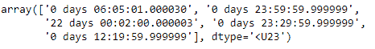
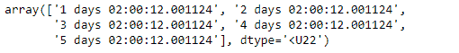

# Python | Pandas time deltaindex . to _ native _ type()

> 原文:[https://www . geesforgeks . org/python-pandas-time deltaindex-to _ native _ types/](https://www.geeksforgeeks.org/python-pandas-timedeltaindex-to_native_types/)

Python 是进行数据分析的优秀语言，主要是因为以数据为中心的 python 包的奇妙生态系统。 ***【熊猫】*** 就是其中一个包，让导入和分析数据变得容易多了。

Pandas `**TimedeltaIndex.to_native_types()**`函数格式化 self (TimedeltaIndex 对象)的指定值，并以其原生格式返回该对象。

> **语法:**time delta index . to _ native _ type(切片器=无，**kwargs)
> 
> **参数:**
> **切片器:**指定格式化过程中使用哪些值的索引器。(int，类似数组)
> **kwargs :** 用于指定值应如何格式化的选项。(格言)
> 
> **返回:**数组对象

**示例#1:** 使用`TimedeltaIndex.to_native_types()`函数将给定的时间增量索引对象格式化为其本机格式。

```
# importing pandas as pd
import pandas as pd

# Create the TimedeltaIndex object
tidx = pd.TimedeltaIndex(data=['06:05:01.000030','+23:59:59.999999',
                        '22 day 2 min 3us 10ns','+23:29:59.999999',
                        '+12:19:59.999999'])

# Print the TimedeltaIndex object
print(tidx)
```

**输出:**


现在我们将使用`TimedeltaIndex.to_native_types()`函数将 tidx 格式化为它的原生类型。

```
# format tidx
tidx.to_native_types()
```

**输出:**


正如我们在输出中看到的那样，`TimedeltaIndex.to_native_types()`函数返回了一个数组对象，该对象包含 dtype ' < U23 '的元素。

**示例 2:** 使用`TimedeltaIndex.to_native_types()`函数将给定的时间增量索引对象格式化为其本机格式。

```
# importing pandas as pd
import pandas as pd

# Create the TimedeltaIndex object
tidx = pd.TimedeltaIndex(start ='1 days 02:00:12.001124', 
                        periods = 5, freq ='D', name ='Koala')

# Print the TimedeltaIndex object
print(tidx)
```

**输出:**


现在我们将使用`TimedeltaIndex.to_native_types()`函数将 tidx 格式化为它的原生类型。

```
# format tidx
tidx.to_native_types()
```

**输出:**

正如我们在输出中看到的，`TimedeltaIndex.to_native_types()`函数返回了一个数组对象，该数组对象包含 dtype ' < U22 '的元素。