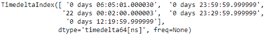
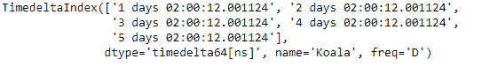
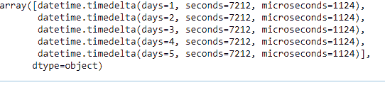

# python \ panda time deleted index . to _ query delta()

> 原文:[https://www . geesforgeks . org/python-pandas-time delta index-to _ pytimedelta/](https://www.geeksforgeeks.org/python-pandas-timedeltaindex-to_pytimedelta/)

Python 是进行数据分析的优秀语言，主要是因为以数据为中心的 python 包的奇妙生态系统。 ***【熊猫】*** 就是其中一个包，让导入和分析数据变得容易多了。

Pandas `**TimedeltaIndex.to_pytimedelta()**`函数返回给定的时间增量索引对象作为 datetime.timedelta 对象的数组。

> **语法**time deleted index . to _ time 增量()
> 
> **参数:**无
> 
> **返回:**日期时间:ndarray

**示例#1:** 使用`TimedeltaIndex.to_pytimedelta()`函数将给定的时间增量索引对象转换为一个数组。

```py
# importing pandas as pd
import pandas as pd

# Create the TimedeltaIndex object
tidx = pd.TimedeltaIndex(data =['06:05:01.000030', '+23:59:59.999999',
                        '22 day 2 min 3us 10ns', '+23:29:59.999999', 
                        '+12:19:59.999999'])

# Print the TimedeltaIndex object
print(tidx)
```

**输出:**


现在我们将使用`TimedeltaIndex.to_pytimedelta()`函数返回一个从给定的时间增量索引对象构造的数组。

```py
# convert to datetime.timedelta
tidx.to_pytimedelta()
```

**输出:**


正如我们在输出中看到的那样，`TimedeltaIndex.to_pytimedelta()`函数返回了一个数组对象，该对象包含给定时间增量索引对象的元素作为对象类型。

**示例 2:** 使用`TimedeltaIndex.to_pytimedelta()`函数将给定的时间增量索引对象转换为数组。

```py
# importing pandas as pd
import pandas as pd

# Create the TimedeltaIndex object
tidx = pd.TimedeltaIndex(start ='1 days 02:00:12.001124', 
                        periods = 5, freq ='D', name ='Koala')

# Print the TimedeltaIndex object
print(tidx)
```

**输出:**


现在我们将使用`TimedeltaIndex.to_pytimedelta()`函数返回一个从给定的时间增量索引对象构造的数组。

```py
# convert to datetime.timedelta
tidx.to_pytimedelta()
```

**输出:**

正如我们在输出中看到的，`TimedeltaIndex.to_pytimedelta()`函数返回了一个数组对象，该对象包含给定时间增量索引对象的元素作为对象类型。