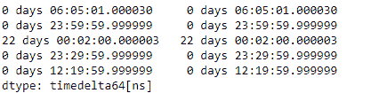
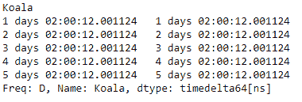

# Python | Pandas time delta index . to _ series()

> 原文:[https://www . geesforgeks . org/python-pandas-time deltaindex-to _ series/](https://www.geeksforgeeks.org/python-pandas-timedeltaindex-to_series/)

Python 是进行数据分析的优秀语言，主要是因为以数据为中心的 python 包的奇妙生态系统。 ***【熊猫】*** 就是其中一个包，让导入和分析数据变得容易多了。

熊猫 `**TimedeltaIndex.to_series()**`函数创建一个系列，其索引和值等于索引键，可用于映射，以返回基于索引的索引器。

> **语法:** TimedeltaIndex.to_series(索引=无，名称=无)
> 
> **参数:**
> **指数:**所得系列指数。如果无，默认为原始索引(索引，可选)
> **名称:**结果系列的名称。如果为无，则默认为原始索引的名称(字符串，可选)
> 
> **返回:**系列:数据类型将基于索引值的类型。

**示例#1:** 使用`TimedeltaIndex.to_series()`函数从给定的时间增量索引对象构建一个序列对象。

```py
# importing pandas as pd
import pandas as pd

# Create the TimedeltaIndex object
tidx = pd.TimedeltaIndex(data =['06:05:01.000030', '+23:59:59.999999',
                        '22 day 2 min 3us 10ns', '+23:29:59.999999',
                        '+12:19:59.999999'])

# Print the TimedeltaIndex object
print(tidx)
```

**输出:**


现在我们将使用`TimedeltaIndex.to_series()`函数，使用 tidx 构造一个 Series 对象。

```py
# return a series
tidx.to_series()
```

**输出:**


正如我们在输出中看到的那样，`TimedeltaIndex.to_series()`函数使用 tidx 对象返回了一个新构造的 Series 对象。请注意，系列的索引也是使用给定对象的标签构建的。

**示例 2:** 使用`TimedeltaIndex.to_series()`函数从给定的时间增量索引对象构造一个序列对象。

```py
# importing pandas as pd
import pandas as pd

# Create the TimedeltaIndex object
tidx = pd.TimedeltaIndex(start ='1 days 02:00:12.001124',
                        periods = 5, freq ='D', name ='Koala')

# Print the TimedeltaIndex object
print(tidx)
```

**输出:**


现在我们将使用`TimedeltaIndex.to_series()`函数，使用 tidx 构造一个 Series 对象。

```py
# return a series
tidx.to_series()
```

**输出:**

正如我们在输出中看到的，`TimedeltaIndex.to_series()`函数已经使用 tidx 对象返回了一个新构造的 Series 对象。请注意，系列的索引也是使用给定对象的标签构建的。