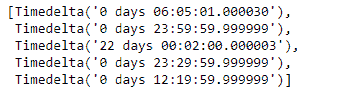
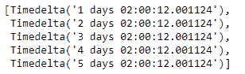

# python \ panda 时标索引. tolist()

> 哎哎哎:# t0]https://www . geeksforgeeks . org/python 熊猫-timedeltaindex-tolist/

Python 是进行数据分析的优秀语言，主要是因为以数据为中心的 python 包的奇妙生态系统。 ***【熊猫】*** 就是其中一个包，让导入和分析数据变得容易多了。

Pandas `**TimedeltaIndex.tolist()**`函数返回给定时间增量索引对象中底层数据的 python 列表。

> **语法:**时时刻刻索引. tolist()
> 
> **参数:**无
> 
> **返回:**列表

**示例#1:** 使用`TimedeltaIndex.tolist()`函数将给定时间增量索引对象的数据作为 python 列表返回。

```
# importing pandas as pd
import pandas as pd

# Create the TimedeltaIndex object
tidx = pd.TimedeltaIndex(data =['06:05:01.000030', '+23:59:59.999999',
                        '22 day 2 min 3us 10ns', '+23:29:59.999999',
                        '+12:19:59.999999'])

# Print the TimedeltaIndex object
print(tidx)
```

**输出:**


现在我们将使用`TimedeltaIndex.tolist()`函数以列表的形式返回 tidx 对象的元素。

```
# return a list
tidx.tolist()
```

**输出:**


正如我们在输出中看到的那样，`TimedeltaIndex.tolist()`函数返回了一个包含 TimedeltaIndex 对象数据的列表。

**示例 2:** 使用`TimedeltaIndex.tolist()`函数将给定时间增量索引对象的数据作为 python 列表返回。

```
# importing pandas as pd
import pandas as pd

# Create the TimedeltaIndex object
tidx = pd.TimedeltaIndex(start ='1 days 02:00:12.001124', 
                        periods = 5, freq ='D', name ='Koala')

# Print the TimedeltaIndex object
print(tidx)
```

**输出:**


现在我们将使用`TimedeltaIndex.tolist()`函数以列表的形式返回 tidx 对象的元素。

```
# return a list
tidx.tolist()
```

**输出:**

正如我们在输出中看到的，`TimedeltaIndex.tolist()`函数已经返回了一个包含 TimedeltaIndex 对象数据的列表。