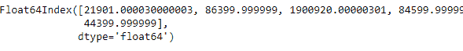
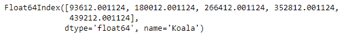

# Python | Pandas time delta index . total _ seconds()

> 原文:[https://www . geesforgeks . org/python-pandas-time deltaindex-total _ seconds/](https://www.geeksforgeeks.org/python-pandas-timedeltaindex-total_seconds/)

Python 是进行数据分析的优秀语言，主要是因为以数据为中心的 python 包的奇妙生态系统。 ***【熊猫】*** 就是其中一个包，让导入和分析数据变得容易多了。

Pandas `**TimedeltaIndex.total_seconds()**`功能用于查找以秒为单位表示的每个元素的总持续时间。它返回一个索引对象。

> **语法:**time delta index . total _ seconds()
> 
> **参数:**无
> 
> **返回:**指数

**示例#1:** 使用`TimedeltaIndex.total_seconds()`函数找出给定时间增量索引对象的每个元素的总持续时间，以秒为单位。

```
# importing pandas as pd
import pandas as pd

# Create the TimedeltaIndex object
tidx = pd.TimedeltaIndex(data =['06:05:01.000030', '+23:59:59.999999',
                        '22 day 2 min 3us 10ns', '+23:29:59.999999', 
                        '+12:19:59.999999'])

# Print the TimedeltaIndex object
print(tidx)
```

**输出:**


现在我们将使用`TimedeltaIndex.total_seconds()`函数来查找 tidx 对象每个元素的总秒数。

```
# time duration of each element expressed in seconds
tidx.total_seconds()
```

**输出:**


正如我们在输出中看到的那样，`TimedeltaIndex.total_seconds()`函数返回了一个索引对象，该对象包含 TimedeltaIndex 对象的每个元素的持续时间，以秒为单位。

**示例 2:** 使用`TimedeltaIndex.total_seconds()`函数找出给定时间增量索引对象的每个元素的总持续时间，以秒为单位。

```
# importing pandas as pd
import pandas as pd

# Create the TimedeltaIndex object
tidx = pd.TimedeltaIndex(start ='1 days 02:00:12.001124',
                        periods = 5, freq ='D', name ='Koala')

# Print the TimedeltaIndex object
print(tidx)
```

**输出:**


现在我们将使用`TimedeltaIndex.total_seconds()`函数来查找 tidx 对象每个元素的总秒数。

```
# time duration of each element expressed in seconds
tidx.total_seconds()
```

**输出:**

正如我们在输出中看到的，`TimedeltaIndex.total_seconds()`函数返回了一个 index 对象，该对象包含 TimedeltaIndex 对象的每个元素的持续时间，以秒为单位。