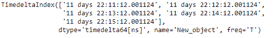
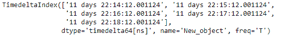
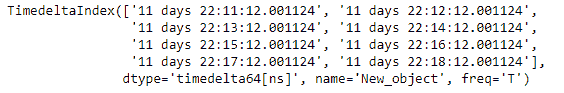
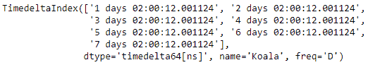

# python | pandas time delta index . union()

> 哎哎哎:# t0]https://www . geeksforgeeks . org/python-pandas-time delta index-union/

Python 是进行数据分析的优秀语言，主要是因为以数据为中心的 python 包的奇妙生态系统。 ***【熊猫】*** 就是其中一个包，让导入和分析数据变得容易多了。

熊猫 **TimedeltaIndex.union()** 函数是一个专门针对 TimedeltaIndex 对象的联合。它将重叠的范围与相同的日期偏移量相结合，将比 Index.union 快得多

> **语法:** TimedeltaIndex.union(其他)
> **参数:**
> **其他:** TimedeltaIndex 或类似数组的
> **返回:** Index 或 TimedeltaIndex

**示例#1:** 使用 TimedeltaIndex.union()函数查找两个 TimedeltaIndex 对象的集合并集。

## 蟒蛇 3

```
# importing pandas as pd
import pandas as pd

# Create the first TimedeltaIndex object
tidx1 = pd.TimedeltaIndex(start ='11 days 22:11:12.001124',
                         periods = 5, freq ='T', name ='New_object')

# Create the second TimedeltaIndex object
tidx2 = pd.TimedeltaIndex(start ='11 days 22:14:12.001124',
                         periods = 5, freq ='T', name ='New_object')

# Print the first TimedeltaIndex object
print(tidx1)

# Print the second TimedeltaIndex object
print(tidx2)
```

**输出:**





现在我们将使用 TimedeltaIndex.union()函数来找到这两个对象的集合并集

## 蟒蛇 3

```
# find the union
tidx1.union(tidx2)
```

**输出:**



正如我们在输出中看到的，TimedeltaIndex.union()函数返回了一个包含 tidx1 和 tidx2 的并集的对象。

**示例#2:** 使用 TimedeltaIndex.union()函数查找两个 TimedeltaIndex 对象的集合并集。

## 蟒蛇 3

```
# importing pandas as pd
import pandas as pd

# Create the first TimedeltaIndex object
tidx1 = pd.TimedeltaIndex(start ='1 days 02:00:12.001124',
                         periods = 5, freq ='D', name ='Koala')

# Create the second TimedeltaIndex object
tidx2 = pd.TimedeltaIndex(start ='3 days 02:00:12.001124',
                         periods = 5, freq ='D', name ='Koala')

# Print the first TimedeltaIndex object
print(tidx1)

# Print the second TimedeltaIndex object
print(tidx2)
```

**输出:**


现在我们将使用 TimedeltaIndex.union()函数来找到这两个对象的集合并集

## 蟒蛇 3

```
# find the union
tidx1.union(tidx2)
```

**输出:**



正如我们在输出中看到的，TimedeltaIndex.union()函数返回了一个包含 tidx1 和 tidx2 的并集的对象。