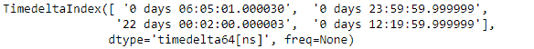
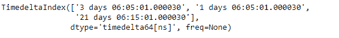

# python | pandas time delta index . unique()

> 哎哎哎:# t0]https://www . geeksforgeeks . org/python 熊猫时间增量索引-unique/

Python 是进行数据分析的优秀语言，主要是因为以数据为中心的 python 包的奇妙生态系统。 ***【熊猫】*** 就是其中一个包，让导入和分析数据变得容易多了。

熊猫 `**TimedeltaIndex.unique()**`函数返回给定时间增量索引对象中的所有唯一值。所有唯一的值都是按其出现的顺序返回的，它不会对值进行排序。

> **语法:**时间增量索引。唯一(值=无)
> 
> **参数:**
> **值:** 1d 阵状
> 
> **返回:**唯一值。

**示例#1:** 使用`TimedeltaIndex.unique()`函数返回给定时间增量索引对象中的所有唯一值。

```py
# importing pandas as pd
import pandas as pd

# Create the TimedeltaIndex object
tidx = pd.TimedeltaIndex(data =['06:05:01.000030', '+23:59:59.999999',
                        '22 day 2 min 3us 10ns', '06:05:01.000030',
                        '+12:19:59.999999'])

# Print the TimedeltaIndex object
print(tidx)
```

**输出:**


现在我们将使用`TimedeltaIndex.unique()`函数来查找 tidx 对象中的所有唯一值。

```py
# return unique values.
tidx.unique()
```

**输出:**


正如我们在输出中看到的那样，`TimedeltaIndex.unique()`函数返回了一个包含给定时间增量索引对象中所有唯一值的索引对象。

**示例 2:** 使用`TimedeltaIndex.unique()`函数返回给定时间增量索引对象中的所有唯一值。

```py
# importing pandas as pd
import pandas as pd

# Create the TimedeltaIndex object
tidx = pd.TimedeltaIndex(data =['3 days 06:05:01.000030','1 days 06:05:01.000030',
                        '3 days 06:05:01.000030', '1 days 06:05:01.000030',
                        '21 days 06:15:01.000030'])

# Print the TimedeltaIndex object
print(tidx)
```

**输出:**


现在我们将使用`TimedeltaIndex.unique()`函数来查找 tidx 对象中的所有唯一值。

```py
# return unique values.
tidx.unique()
```

**输出:**

正如我们在输出中看到的，`TimedeltaIndex.unique()`函数返回了一个包含给定时间增量索引对象中所有唯一值的索引对象。