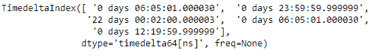
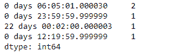
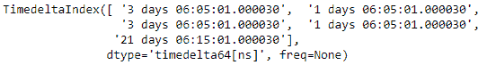
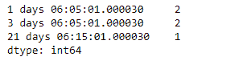

# Python | Pandas time delta index . value _ counts()

> 原文:[https://www . geesforgeks . org/python-pandas-time delta index-value _ counts/](https://www.geeksforgeeks.org/python-pandas-timedeltaindex-value_counts/)

Python 是进行数据分析的优秀语言，主要是因为以数据为中心的 python 包的奇妙生态系统。 ***【熊猫】*** 就是其中一个包，让导入和分析数据变得容易多了。

熊猫 `**TimedeltaIndex.value_counts()**`函数返回一个包含唯一值计数的对象。结果对象将按降序排列，因此第一个元素是最常出现的元素。默认情况下不包括数值。

> **语法:**时间增量索引.值 _ 计数(归一化=假，排序=真，升序=假，箱=无，dropna =真)
> 
> **参数:**
> **归一化:**(布尔值，默认为假)如果为真，则返回的对象将包含唯一值的相对频率。
> **排序:**(布尔值，默认为 True)按值排序
> **升序:**(布尔值，默认为 False)按升序排序
> **条块:**(整数，可选)与其对值进行计数，不如将它们分组到半开条块中，这是 pd.cut 的一种便利，仅适用于数字数据
> **dropna :** (布尔值，默认为 True)不包括 NaN 的计数。
> 
> **返回:**计数:系列

**示例#1:** 使用`TimedeltaIndex.value_counts()`函数计算给定时间增量索引对象中每个唯一值的出现次数。

```
# importing pandas as pd
import pandas as pd

# Create the TimedeltaIndex object
tidx = pd.TimedeltaIndex(data =['06:05:01.000030', '+23:59:59.999999',
                        '22 day 2 min 3us 10ns', '06:05:01.000030',
                        '+12:19:59.999999'])

# Print the TimedeltaIndex object
print(tidx)
```

**输出:**


现在我们将使用`TimedeltaIndex.value_counts()`函数来计算 tidx 对象中每个唯一值的出现次数。

```
# count occurrences
tidx.value_counts()
```

**输出:**


正如我们在输出中看到的那样，`TimedeltaIndex.value_counts()`函数返回了给定时间增量索引对象中所有唯一值的计数。

**示例 2:** 使用`TimedeltaIndex.value_counts()`函数计算给定时间增量索引对象中每个唯一值的出现次数。

```
# importing pandas as pd
import pandas as pd

# Create the TimedeltaIndex object
tidx = pd.TimedeltaIndex(data =['3 days 06:05:01.000030', '1 days 06:05:01.000030',
                        '3 days 06:05:01.000030', '1 days 06:05:01.000030',
                        '21 days 06:15:01.000030'])

# Print the TimedeltaIndex object
print(tidx)
```

**输出:**


现在我们将使用`TimedeltaIndex.value_counts()`函数来计算 tidx 对象中每个唯一值的出现次数。

```
# count occurrences
tidx.value_counts()
```

**输出:**

正如我们在输出中看到的，`TimedeltaIndex.value_counts()`函数返回了给定时间增量索引对象中所有唯一值的计数。