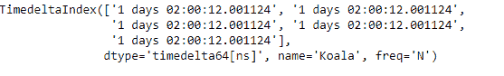
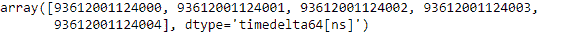
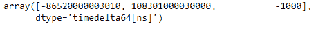

# Python |熊猫时间增量指数.数值

> 原文:[https://www . geesforgeks . org/python-pandas-time delta index-values/](https://www.geeksforgeeks.org/python-pandas-timedeltaindex-values/)

Python 是进行数据分析的优秀语言，主要是因为以数据为中心的 python 包的奇妙生态系统。 ***【熊猫】*** 就是其中一个包，让导入和分析数据变得容易多了。

熊猫 `**TimedeltaIndex.values**`属性返回给定时间增量索引对象的基础数据作为一个数组。

> **语法:**时间增量索引值
> 
> **返回:**ndaarray

**示例#1:** 使用`TimedeltaIndex.values`属性将给定时间增量索引对象的值作为数组返回。

```py
# importing pandas as pd
import pandas as pd

# Create the TimedeltaIndex object
tidx = pd.TimedeltaIndex(start ='1 days 02:00:12.001124', periods = 5, 
                                            freq ='N', name ='Koala')

# Print the TimedeltaIndex
print(tidx)
```

**输出:**


现在我们将打印给定 tidx 对象的数据作为一个数组。

```py
# return the data of tidx as an ndarray
tidx.values
```

**输出:**

我们可以在输出中看到，`TimedeltaIndex.values`属性已经将 tidx 的数据作为一个数组返回。

**示例#2:** 使用`TimedeltaIndex.values`属性将给定时间增量索引对象的值作为数组返回。

```py
# importing pandas as pd
import pandas as pd

# Create the TimedeltaIndex object
tidx = pd.TimedeltaIndex(data =['-1 days 2 min 3us 10ns', '1 days 06:05:01.000030',
                                                      '-1 days + 23:59:59.999999'])

# Print the TimedeltaIndex
print(tidx)
```

**输出:**


现在我们将打印给定 tidx 对象的数据作为一个数组。

```py
# return the data of tidx as an ndarray
tidx.values
```

**输出:**

正如我们在输出中看到的，`TimedeltaIndex.values`属性已经将 tidx 的数据作为一个数组返回。