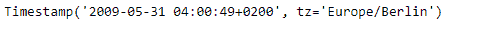
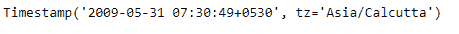

# Python | Pandas timestamp . astimezone

> 原文:[https://www . geesforgeks . org/python-pandas-timestamp-astimezone/](https://www.geeksforgeeks.org/python-pandas-timestamp-astimezone/)

Python 是进行数据分析的优秀语言，主要是因为以数据为中心的 python 包的奇妙生态系统。 ***【熊猫】*** 就是其中一个包，让导入和分析数据变得容易多了。

熊猫 `**Timestamp.astimezone()**`功能将感知时间标记转换为另一个时区。对于无时间戳对象，该函数会抛出一个错误。

> **语法:** Timestamp.astimezone()
> 
> **参数:**
> **tz :** 时间戳将转换到的时区。
> 
> **返回:**已转换:时间戳

**示例#1:** 使用`Timestamp.astimezone()`功能将给定对象的时区更改为“欧洲/柏林”。

```
# importing pandas as pd
import pandas as pd

# Create the Timestamp object
ts = pd.Timestamp(year = 2011,  month = 11, day = 21,
           hour = 10, second = 49, tz = 'US/Central')

# Print the Timestamp object
print(ts)
```

**输出:**


现在我们将使用`Timestamp.astimezone()`功能将 ts 对象的时区更改为所需的时区。

```
# change the timezone to 'Europe/Berlin'
ts.astimezone('Europe/Berlin')
```

**输出:**



正如我们在输出中看到的那样，`Timestamp.astimezone()`函数已经将给定 Timestamp 对象的时区从“美国/中部”更改为“欧洲/柏林”。

**示例 2:** 使用`Timestamp.astimezone()`函数将给定对象的时区更改为“亚洲/加尔各答”。

```
# importing pandas as pd
import pandas as pd

# Create the Timestamp object
ts = pd.Timestamp(year = 2009,  month = 5, day = 31,
        hour = 4, second = 49, tz = 'Europe/Berlin')

# Print the Timestamp object
print(ts)
```

**输出:**


现在我们将使用`Timestamp.astimezone()`功能将 ts 对象的时区更改为所需的时区。

```
# change the timezone to 'Asia / Calcutta'
ts.astimezone('Asia/Calcutta')
```

**输出:**



正如我们在输出中看到的那样，`Timestamp.astimezone()`函数已经将给定 Timestamp 对象的时区从“欧洲/柏林”更改为“亚洲/加尔各答”。