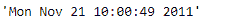
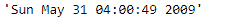

# Python |熊猫时间戳。ctime

> 哎哎哎:1230【https://www . geeksforgeeks . org/python 熊猫时间戳受害者/

Python 是进行数据分析的优秀语言，主要是因为以数据为中心的 python 包的奇妙生态系统。 ***【熊猫】*** 就是其中一个包，让导入和分析数据变得容易多了。

熊猫 `**Timestamp.ctime()**`函数以字符串格式返回时间。返回的字符串对象的格式基于 ctime()样式。

> **语法:** Timestamp.ctime()
> 
> **参数:**无
> 
> **返回:**时间

**示例#1:** 使用`Timestamp.ctime()`函数以字符串格式返回给定时间戳对象的时间。

```py
# importing pandas as pd
import pandas as pd

# Create the Timestamp object
ts = pd.Timestamp(year = 2011,  month = 11, day = 21,
           hour = 10, second = 49, tz = 'US/Central')

# Print the Timestamp object
print(ts)
```

**输出:**


现在我们将使用`Timestamp.ctime()`函数以字符串格式返回时间。

```py
# return the time in ctime() style 
ts.ctime()
```

**输出:**



正如我们在输出中看到的那样，`Timestamp.ctime()`函数以字符串格式返回了给定 Timestamp 对象的时间。

**示例 2:** 使用`Timestamp.ctime()`函数以字符串格式返回给定时间戳对象的时间。

```py
# importing pandas as pd
import pandas as pd

# Create the Timestamp object
ts = pd.Timestamp(year = 2009,  month = 5, day = 31,
        hour = 4, second = 49, tz = 'Europe/Berlin')

# Print the Timestamp object
print(ts)
```

**输出:**


现在我们将使用`Timestamp.ctime()`函数以字符串格式返回时间。

```py
# return the time in ctime() style 
ts.ctime()
```

**输出:**



正如我们在输出中看到的那样，`Timestamp.ctime()`函数以字符串格式返回了给定 Timestamp 对象的时间。