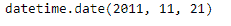
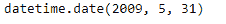

# 蟒蛇|熊猫时间戳.日期

> 原文:[https://www.geeksforgeeks.org/python-pandas-timestamp-date/](https://www.geeksforgeeks.org/python-pandas-timestamp-date/)

Python 是进行数据分析的优秀语言，主要是因为以数据为中心的 python 包的奇妙生态系统。 ***【熊猫】*** 就是其中一个包，让导入和分析数据变得容易多了。

Pandas `**Timestamp.date()**`函数返回一个日期时间对象，其年、月、日与给定的 Timestamp 对象相同。

> **语法:** Timestamp.date()
> 
> **参数:**无
> 
> **返回:**日期

**示例#1:** 使用`Timestamp.date()`函数将给定时间戳对象的日期作为日期时间对象返回。

```
# importing pandas as pd
import pandas as pd

# Create the Timestamp object
ts = pd.Timestamp(year = 2011,  month = 11, day = 21,
           hour = 10, second = 49, tz = 'US/Central')

# Print the Timestamp object
print(ts)
```

**输出:**


现在我们将使用`Timestamp.date()`函数将日期作为日期时间对象返回。

```
# return as a datetime object 
ts.date()
```

**输出:**



正如我们在输出中看到的那样，`Timestamp.date()`函数返回了一个日期时间对象，该对象包含与给定的 Timestamp 对象相同的年、月和日。

**示例 2:** 使用`Timestamp.date()`函数将给定时间戳对象的日期作为日期时间对象返回。

```
# importing pandas as pd
import pandas as pd

# Create the Timestamp object
ts = pd.Timestamp(year = 2009,  month = 5, day = 31,
        hour = 4, second = 49, tz = 'Europe/Berlin')

# Print the Timestamp object
print(ts)
```

**输出:**


现在我们将使用`Timestamp.date()`函数将日期作为日期时间对象返回。

```
# return as a datetime object 
ts.date()
```

**输出:**



正如我们在输出中看到的那样，`Timestamp.date()`函数返回了一个日期时间对象，该对象包含与给定的 Timestamp 对象相同的年、月和日。