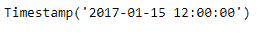
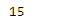
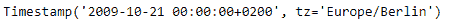
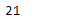

# 蟒蛇|熊猫时间戳. day

> 原文:[https://www.geeksforgeeks.org/python-pandas-timestamp-day/](https://www.geeksforgeeks.org/python-pandas-timestamp-day/)

Python 是进行数据分析的优秀语言，主要是因为以数据为中心的 python 包的奇妙生态系统。 ***【熊猫】*** 就是其中一个包，让导入和分析数据变得容易多了。

熊猫 `**Timestamp.day**`属性返回给定时间戳对象中的日期值。

> **语法:**时间戳.日
> 
> **参数:**无
> 
> **返程:**天

**示例#1:** 使用`Timestamp.day`属性在给定的 Timestamp 对象中查找日值。

```py
# importing pandas as pd
import pandas as pd

# Create the Timestamp object
ts = pd.Timestamp(2017, 1, 15, 12)

# Print the Timestamp object
print(ts)
```

**输出:**



现在我们将使用`Timestamp.day`属性找出给定时间戳对象中的日值。

```py
# return day value
ts.day
```

**输出:**



正如我们在输出中看到的那样，`Timestamp.day`属性返回了 15，表示它是给定 Timestamp 对象中一个月的第 15 天。

**示例 2:** 使用`Timestamp.day`属性在给定的时间戳对象中查找日值。

```py
# importing pandas as pd
import pandas as pd

# Create the Timestamp object
ts = pd.Timestamp(year = 2009, month = 10, 
        day = 21, tz = 'Europe/Berlin')

# Print the Timestamp object
print(ts)
```

**输出:**



现在我们将使用`Timestamp.day`属性找出给定时间戳对象中的日值。

```py
# return day value
ts.day
```

**输出:**



我们可以在输出中看到，`Timestamp.day`属性返回了 21，表示它是给定 Timestamp 对象中的一个月的第 21 天。