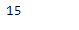

# Python | Pandas timestamp . day fyear

> 原文:[https://www . geesforgeks . org/python-pandas-timestamp-dayofyear/](https://www.geeksforgeeks.org/python-pandas-timestamp-dayofyear/)

Python 是进行数据分析的优秀语言，主要是因为以数据为中心的 python 包的奇妙生态系统。 ***【熊猫】*** 就是其中一个包，让导入和分析数据变得容易多了。

熊猫 `**Timestamp.dayofyear**`属性返回给定时间戳对象的一年中的某一天。天数从 1 到 365。其中 1 是一年的第一天，365 是一年的最后一天。

> **语法:**时间戳. day fyear
> 
> **参数:**无
> 
> **返回:**一年中的某一天

**示例#1:** 使用`Timestamp.dayofyear`属性在给定的 Timestamp 对象中查找一年中的某一天。

```py
# importing pandas as pd
import pandas as pd

# Create the Timestamp object
ts = pd.Timestamp(2017, 1, 15, 12)

# Print the Timestamp object
print(ts)
```

**输出:**


现在我们将使用`Timestamp.dayofyear`属性在给定的 Timestamp 对象中找出一年中的某一天。

```py
# return day of the year
ts.dayofyear
```

**输出:**



我们可以在输出中看到，`Timestamp.dayofyear`属性返回了 15，表示它是给定 Timestamp 对象中的一年中的第 15 天。

**示例#2:** 使用`Timestamp.dayofyear`属性在给定的 Timestamp 对象中查找一年中的某一天。

```py
# importing pandas as pd
import pandas as pd

# Create the Timestamp object
ts = pd.Timestamp(year = 2009, month = 10, 
         day = 21, tz = 'Europe/Berlin')

# Print the Timestamp object
print(ts)
```

**输出:**


现在我们将使用`Timestamp.dayofyear`属性在给定的 Timestamp 对象中找出一年中的某一天。

```py
# return day of the year
ts.dayofyear
```

**输出:**


我们可以在输出中看到，`Timestamp.dayofyear`属性返回了 294，表示它是给定 Timestamp 对象中一年中的第 294 天。