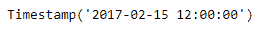

# Python | Pandas timestamp . days in month

> 原文:[https://www . geesforgeks . org/python-pandas-timestamp-daysinmonth/](https://www.geeksforgeeks.org/python-pandas-timestamp-daysinmonth/)

Python 是进行数据分析的优秀语言，主要是因为以数据为中心的 python 包的奇妙生态系统。 ***【熊猫】*** 就是其中一个包，让导入和分析数据变得容易多了。

熊猫 `**Timestamp.daysinmonth**`属性返回时间戳对象中给定日期的月份天数。

> **语法:** Timestamp.daysinmonth
> 
> **参数:**无
> 
> **返回:**月天数

**示例#1:** 使用`Timestamp.daysinmonth`属性找出给定时间戳对象中的天数。

```
# importing pandas as pd
import pandas as pd

# Create the Timestamp object
ts = pd.Timestamp(2017, 2, 15, 12)

# Print the Timestamp object
print(ts)
```

**输出:**



现在我们将使用`Timestamp.daysinmonth`属性找出给定 Timestamp 对象中的天数。

```
# return the number of days in month
ts.daysinmonth
```

**输出:**


我们可以在输出中看到，`Timestamp.daysinmonth`属性返回了 28，表示给定 Timestamp 对象的月份中有 28 天。

**示例 2:** 使用`Timestamp.daysinmonth`属性找出给定时间戳对象中的天数。

```
# importing pandas as pd
import pandas as pd

# Create the Timestamp object
ts = pd.Timestamp(year = 2009, month = 10,
           day = 21, tz = 'Europe/Berlin')

# Print the Timestamp object
print(ts)
```

**输出:**


现在我们将使用`Timestamp.daysinmonth`属性找出给定 Timestamp 对象中的天数。

```
# return the number of days in month
ts.daysinmonth
```

**输出:**


我们可以在输出中看到，`Timestamp.daysinmonth`属性返回了 31，表示给定 Timestamp 对象的月份中有 31 天。