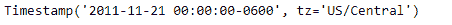
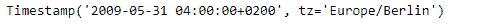

# 蟒蛇|熊猫时间戳. floor

> 原文:[https://www . geesforgeks . org/python-pandas-timestamp-floor/](https://www.geeksforgeeks.org/python-pandas-timestamp-floor/)

Python 是进行数据分析的优秀语言，主要是因为以数据为中心的 python 包的奇妙生态系统。 ***【熊猫】*** 就是其中一个包，让导入和分析数据变得容易多了。

熊猫 `**Timestamp.floor()**`函数返回一个新的时间戳到这个分辨率。该函数将所需的时间序列频率作为输入。

> **语法:** Timestamp.floor()
> 
> **参数:**
> **频率:**表示地板分辨率的频率字符串
> 
> **返回:**时间戳

**示例#1:** 使用`Timestamp.floor()`功能将给定的时间戳对象设定为每日时间序列频率。

```
# importing pandas as pd
import pandas as pd

# Create the Timestamp object
ts = pd.Timestamp(year = 2011,  month = 11, day = 21,
           hour = 10, second = 49, tz = 'US/Central')

# Print the Timestamp object
print(ts)
```

**输出:**


现在我们将使用`Timestamp.floor()`功能将 ts 对象设置为每日频率。

```
# floor the given object to daily frequency
ts.floor(freq ='D')
```

**输出:**



正如我们在输出中看到的那样，`Timestamp.floor()`函数已经将给定时间戳对象的时间序列频率钻到了输入频率。

**示例#2:** 使用`Timestamp.floor()`功能将给定的时间戳对象设定为精确的时间序列频率。

```
# importing pandas as pd
import pandas as pd

# Create the Timestamp object
ts = pd.Timestamp(year = 2009,  month = 5, day = 31, 
       hour = 4, second = 49, tz = 'Europe/Berlin')

# Print the Timestamp object
print(ts)
```

**输出:**


现在我们将使用`Timestamp.floor()`功能将 ts 对象精确到频率。

```
# floor the given object to minutely frequency
ts.floor(freq ='T')
```

**输出:**



正如我们在输出中看到的那样，`Timestamp.floor()`函数已经将给定时间戳对象的时间序列频率钻到了输入频率。