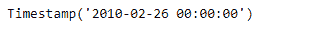

# Python | Pandas timestamp . from 序数

> 原文:[https://www . geesforgeks . org/python-pandas-timestamp-from 序数/](https://www.geeksforgeeks.org/python-pandas-timestamp-fromordinal/)

Python 是进行数据分析的优秀语言，主要是因为以数据为中心的 python 包的奇妙生态系统。 ***【熊猫】*** 就是其中一个包，让导入和分析数据变得容易多了。

熊猫 `**Timestamp.fromordinal()**`函数返回一个时间戳对象，当传递一个序数时，该函数将其翻译并转换为 ts 对象。根据定义，序数本身不能有任何 tz 信息。

> **语法:**时间戳. from 序数()
> 
> **参数:**
> 
> **序数:**对应于前罗马公历序数的日期
> 
> **频率:**时间戳的偏移量
> 
> **tz :** 时间戳将具有的时区
> 
> **返回:**时间戳

**示例#1:** 使用`Timestamp.fromordinal()`函数根据传递的序号值翻译给定的时间戳对象。

```py
# importing pandas as pd
import pandas as pd

# Create the Timestamp object
ts = pd.Timestamp(year = 2011,  month = 11, day = 21,
                  hour = 10, second = 49, tz = 'US/Central')

# Print the Timestamp object
print(ts)
```

**输出:**


现在我们将使用`Timestamp.fromordinal()`函数转换给定的 Timestamp 对象。

```py
# convert the given Timestamp object
# based on the passed ordinal value
ts.fromordinal(ordinal = 733829)
```

**输出:**



正如我们在输出中看到的那样，`Timestamp.fromordinal()`函数根据传递的序号值返回了一个新的 Timestamp 对象。

**示例#2:** 使用`Timestamp.fromordinal()`函数根据传递的序号值翻译给定的时间戳对象。还要设置时区。

```py
# importing pandas as pd
import pandas as pd

# Create the Timestamp object
ts = pd.Timestamp(year = 2009, month = 5, day = 31,
                  hour = 4, second = 49, tz = 'Europe/Berlin')

# Print the Timestamp object
print(ts)
```

**输出:**


现在我们将使用`Timestamp.fromordinal()`函数转换给定的 Timestamp 对象。

```py
# convert the given Timestamp object
# based on the passed ordinal value
ts.fromordinal(ordinal = 634816, tz = 'Asia / Calcutta')
```

**输出:**


正如我们在输出中看到的那样，`Timestamp.fromordinal()`函数根据传递的序号值返回了一个新的 Timestamp 对象。该函数还为返回的时间戳对象设置了时区。