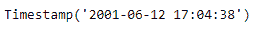
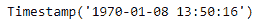

# Python | Pandas timestamp . from timestamp

> 原文:[https://www . geesforgeks . org/python-pandas-timestamp-from timestamp/](https://www.geeksforgeeks.org/python-pandas-timestamp-fromtimestamp/)

Python 是进行数据分析的优秀语言，主要是因为以数据为中心的 python 包的奇妙生态系统。 ***【熊猫】*** 就是其中一个包，让导入和分析数据变得容易多了。

熊猫 `**Timestamp.fromtimestamp()**`函数在传递代表时间戳值的整数时返回一个时间戳对象。

> **语法:** Timestamp.fromtimestamp()
> 
> **参数:**整数
> 
> **返回:**时间戳

**示例#1:** 使用`Timestamp.fromtimestamp()`函数从传递的值中返回时间戳对象。

```py
# importing pandas as pd
import pandas as pd

# Create the Timestamp object
ts = pd.Timestamp(year = 2011,  month = 11, day = 21,
                  hour = 10, second = 49, tz = 'US/Central')

# Print the Timestamp object
print(ts)
```

**输出:**


现在我们将使用`Timestamp.fromtimestamp()`函数从传递的值中返回一个 Timestamp 对象。

```py
# convert to a Timestamp object
ts.fromtimestamp(992345678)
```

**输出:**



正如我们在输出中看到的那样，`Timestamp.fromtimestamp()`函数返回了一个由传递的值构造的新的 Timestamp 对象。

**示例#2:** 使用`Timestamp.fromtimestamp()`函数从传递的值中返回时间戳对象。

```py
# importing pandas as pd
import pandas as pd

# Create the Timestamp object
ts = pd.Timestamp(year = 2009, month = 5, day = 31,
                  hour = 4, second = 49, tz = 'Europe/Berlin')

# Print the Timestamp object
print(ts)
```

**输出:**


现在我们将使用`Timestamp.fromtimestamp()`函数从传递的值中返回一个 Timestamp 对象。

```py
# convert to a Timestamp object
ts.fromtimestamp(634816)
```

**输出:**



正如我们在输出中看到的那样，`Timestamp.fromtimestamp()`函数返回了一个由传递的值构造的新的 Timestamp 对象。