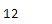

# 蟒蛇|熊猫时间戳.小时

> 原文:[https://www.geeksforgeeks.org/python-pandas-timestamp-hour/](https://www.geeksforgeeks.org/python-pandas-timestamp-hour/)

Python 是进行数据分析的优秀语言，主要是因为以数据为中心的 python 包的奇妙生态系统。 ***【熊猫】*** 就是其中一个包，让导入和分析数据变得容易多了。

熊猫 `**Timestamp.hour**`属性返回给定时间戳对象的小时值。

> **语法:**时间戳.小时
> 
> **参数:**无
> 
> **返回:**小时

**示例#1:** 使用`Timestamp.hour`属性找出给定时间戳对象中的小时值。

```
# importing pandas as pd
import pandas as pd

# Create the Timestamp object
ts = pd.Timestamp(2017, 2, 15, 12)

# Print the Timestamp object
print(ts)
```

**输出:**


现在我们将使用`Timestamp.hour`属性找出给定时间戳对象中的小时值。

```
# return the hour value
ts.hour
```

**输出:**



正如我们在输出中看到的，对于给定的 Timestamp 对象，`Timestamp.hour`属性返回了 12 作为小时值。

**示例#2:** 使用`Timestamp.hour`属性找出给定时间戳对象中的小时值。

```
# importing pandas as pd
import pandas as pd

# Create the Timestamp object
ts = pd.Timestamp(year = 2009, month = 10, day = 21,
                     hour = 4, tz = 'Europe/Berlin')

# Print the Timestamp object
print(ts)
```

**输出:**


现在我们将使用`Timestamp.hour`属性找出给定时间戳对象中的小时值。

```
# return the hour value
ts.hour
```

**输出:**


正如我们在输出中看到的那样，`Timestamp.hour`属性返回了 4 作为给定 Timestamp 对象的小时值。