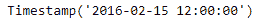
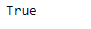
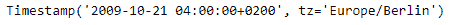
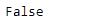

# Python | Pandas timestamp . is _ leap _ year

> 原文:[https://www . geesforgeks . org/python-pandas-timestamp-is _ leap _ year/](https://www.geeksforgeeks.org/python-pandas-timestamp-is_leap_year/)

Python 是进行数据分析的优秀语言，主要是因为以数据为中心的 python 包的奇妙生态系统。 ***【熊猫】*** 就是其中一个包，让导入和分析数据变得容易多了。

熊猫 `**Timestamp.is_leap_year**`属性返回一个布尔值。如果给定时间戳对象中的日期是闰年，则返回`True`，否则返回`False`。

> **语法:** Timestamp.is_leap_year
> 
> **参数:**无
> 
> **返回:**布尔值

**示例#1:** 使用`Timestamp.is_leap_year`属性检查给定时间戳对象中的日期是否为闰年。

```py
# importing pandas as pd
import pandas as pd

# Create the Timestamp object
ts = pd.Timestamp(2016, 2, 15, 12)

# Print the Timestamp object
print(ts)
```

**输出:**



现在我们将使用`Timestamp.is_leap_year`属性来找出 ts 对象中的日期是否是闰年。

```py
# check for leap year
ts.is_leap_year
```

**输出:**



正如我们在输出中看到的那样，`Timestamp.is_leap_year`属性返回了`True`，表示给定 Timestamp 对象中的日期是闰年。

**示例 2:** 使用`Timestamp.is_leap_year`属性检查给定时间戳对象中的日期是否为闰年。

```py
# importing pandas as pd
import pandas as pd

# Create the Timestamp object
ts = pd.Timestamp(year = 2009, month = 10, day = 21,
                     hour = 4, tz = 'Europe/Berlin')

# Print the Timestamp object
print(ts)
```

**输出:**



现在我们将使用`Timestamp.is_leap_year`属性来找出 ts 对象中的日期是否是闰年。

```py
# check for leap year
ts.is_leap_year
```

**输出:**



正如我们在输出中看到的那样，`Timestamp.is_leap_year`属性返回了`False`，表示给定 Timestamp 对象中的日期不是闰年。