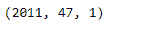
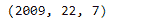

# python | pandas timestamp . iso calendar

> 哎哎哎:# t0]https://www . geeksforgeeks . org/python 熊猫时间戳等日历/

Python 是进行数据分析的优秀语言，主要是因为以数据为中心的 python 包的奇妙生态系统。 ***【熊猫】*** 就是其中一个包，让导入和分析数据变得容易多了。

Pandas `**Timestamp.isocalendar()**`函数返回一个三元组，包含给定时间戳对象的 ISO 年、周数和工作日。

> **语法:** Timestamp.isocalendar()
> 
> **参数:**无
> 
> **返回:**元组

**示例#1:** 使用`Timestamp.isocalendar()`函数返回基于 ISO 日历的给定时间戳对象的日期。

```py
# importing pandas as pd
import pandas as pd

# Create the Timestamp object
ts = pd.Timestamp(year = 2011,  month = 11, day = 21,
                  hour = 10, second = 49, tz = 'US/Central')

# Print the Timestamp object
print(ts)
```

**输出:**


现在我们将使用`Timestamp.isocalendar()`函数返回基于 ISO 日历的 ts 对象中的日期。

```py
# return the date as an ISO calendar
ts.isocalendar()
```

**输出:**



正如我们在输出中看到的那样，`Timestamp.isocalendar()`函数返回了一个元组，该元组包含给定 Timestamp 对象的年、周数和星期几。

**示例 2:** 使用`Timestamp.isocalendar()`函数返回基于 ISO 日历的给定 Timestamp 对象的日期。

```py
# importing pandas as pd
import pandas as pd

# Create the Timestamp object
ts = pd.Timestamp(year = 2009, month = 5, day = 31,
                  hour = 4, second = 49, tz = 'Europe/Berlin')

# Print the Timestamp object
print(ts)
```

**输出:**


现在我们将使用`Timestamp.isocalendar()`功能返回基于 ISO 日历的 ts 对象中的日期

```py
# return the date as an ISO calendar
ts.isocalendar()
```

**输出:**



正如我们在输出中看到的那样，`Timestamp.isocalendar()`函数返回了一个元组，该元组包含给定 Timestamp 对象的年、周数和星期几。