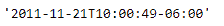
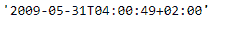

# python | pandas timestamp . iso format

中

> 原文:[https://www . geesforgeks . org/python-pandas-timestamp-isoformat/](https://www.geeksforgeeks.org/python-pandas-timestamp-isoformat/)

Python 是进行数据分析的优秀语言，主要是因为以数据为中心的 python 包的奇妙生态系统。 ***【熊猫】*** 就是其中一个包，让导入和分析数据变得容易多了。

Pandas `**Timestamp.isoformat()**`功能用于将给定的 Timestamp 对象转换为 ISO 格式。

> **语法:** Timestamp.isoformat()
> 
> **参数:**无
> 
> **返回:**字符串形式的日期时间

**示例#1:** 使用`Timestamp.isoformat()`函数将给定时间戳对象中的日期转换为 ISO 格式。

```py
# importing pandas as pd
import pandas as pd

# Create the Timestamp object
ts = pd.Timestamp(year = 2011,  month = 11, day = 21,
                  hour = 10, second = 49, tz = 'US/Central')

# Print the Timestamp object
print(ts)
```

**输出:**


现在我们将使用`Timestamp.isoformat()`函数将给定时间戳对象中的日期转换为 ISO 格式。

```py
# convert to ISO format
ts.isoformat()
```

**输出:**



正如我们在输出中看到的，`Timestamp.isoformat()`函数已经以 ISO 格式返回了日期。

**示例#2:** 使用`Timestamp.isoformat()`函数将给定时间戳对象中的日期转换为 ISO 格式。

```py
# importing pandas as pd
import pandas as pd

# Create the Timestamp object
ts = pd.Timestamp(year = 2009, month = 5, day = 31,
                  hour = 4, second = 49, tz = 'Europe/Berlin')

# Print the Timestamp object
print(ts)
```

**输出:**


现在我们将使用`Timestamp.isoformat()`函数将给定时间戳对象中的日期转换为 ISO 格式。

```py
# convert to ISO format
ts.isoformat()
```

**输出:**



正如我们在输出中看到的，`Timestamp.isoformat()`函数已经以 ISO 格式返回了日期。