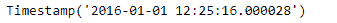
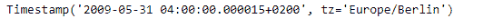

# 蟒蛇|熊猫时间戳.分钟

> 原文:[https://www . geesforgeks . org/python-pandas-timestamp-minute/](https://www.geeksforgeeks.org/python-pandas-timestamp-minute/)

Python 是进行数据分析的优秀语言，主要是因为以数据为中心的 python 包的奇妙生态系统。 ***【熊猫】*** 就是其中一个包，让导入和分析数据变得容易多了。

熊猫 `**Timestamp.minute**`属性返回给定时间戳对象中的分钟值。如果尚未设置分钟值，则返回 0。

> **语法:**时间戳.分钟
> 
> **参数:**无
> 
> **返回:**分钟

**示例#1:** 使用`Timestamp.minute`属性在给定的 Timestamp 对象中查找分钟值。

```py
# importing pandas as pd
import pandas as pd

# Create the Timestamp object
ts = pd.Timestamp(2016, 1, 1, 12, 25, 16, 28)

# Print the Timestamp object
print(ts)
```

**输出:**



现在我们将使用`Timestamp.minute`属性打印 ts 对象中的分钟值。

```py
# find the value of minute
ts.minute
```

**输出:**


我们可以在输出中看到，`Timestamp.minute`属性返回了 25，表示 ts 对象中的分钟值设置为 25。

**示例 2:** 使用`Timestamp.minute`属性在给定的时间戳对象中查找分钟值。

```py
# importing pandas as pd
import pandas as pd

# Create the Timestamp object
ts = pd.Timestamp(year = 2009, month = 5, day = 31, hour = 4,
                     microsecond = 15, tz = 'Europe/Berlin')

# Print the Timestamp object
print(ts)
```

**输出:**



现在我们将使用`Timestamp.minute`属性打印 ts 对象中的分钟值。

```py
# find the value of minute
ts.minute
```

**输出:**


正如我们在输出中看到的那样，`Timestamp.minute`属性返回了 0，因为没有为给定的 ts 对象设置分钟值，所以输出为 0。