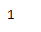

# 蟒蛇|熊猫时间戳.月

> 原文:[https://www . geesforgeks . org/python-pandas-timestamp-month/](https://www.geeksforgeeks.org/python-pandas-timestamp-month/)

Python 是进行数据分析的优秀语言，主要是因为以数据为中心的 python 包的奇妙生态系统。 ***【熊猫】*** 就是其中一个包，让导入和分析数据变得容易多了。

Pandas `**Timestamp.month**`属性用于在给定的 Timestamp 对象中查找月份值。

> **语法:**时间戳.月
> 
> **参数:**无
> 
> **返回:**月

**示例#1:** 使用`Timestamp.month`属性在给定的 Timestamp 对象中查找月份值。

```
# importing pandas as pd
import pandas as pd

# Create the Timestamp object
ts = pd.Timestamp(2016, 1, 1, 12, 25, 16, 28)

# Print the Timestamp object
print(ts)
```

**输出:**


现在我们将使用`Timestamp.month`属性打印 ts 对象中的月值。

```
# find the value of month 
ts.month
```

**输出:**



正如我们在输出中看到的那样，`Timestamp.month`属性返回了 1，表示 ts 对象中的月值设置为 1。

**示例#2:** 使用`Timestamp.month`属性在给定的 Timestamp 对象中查找月份值。

```
# importing pandas as pd
import pandas as pd

# Create the Timestamp object
ts = pd.Timestamp(year = 2009, month = 5, day = 31, hour = 4, 
                      microsecond = 15, tz = 'Europe/Berlin')

# Print the Timestamp object
print(ts)
```

**输出:**


现在我们将使用`Timestamp.month`属性打印 ts 对象中的月值。

```
# find the value of month 
ts.month
```

**输出:**


我们可以在输出中看到，`Timestamp.month`属性返回了 5，表示 ts 对象中的月值设置为 5。