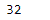
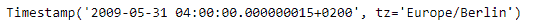
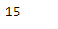

# Python | Pandas Timestamp .纳秒

> 原文:[https://www . geesforgeks . org/python-pandas-timestamp-纳秒/](https://www.geeksforgeeks.org/python-pandas-timestamp-nanosecond/)

Python 是进行数据分析的优秀语言，主要是因为以数据为中心的 python 包的奇妙生态系统。 ***【熊猫】*** 就是其中一个包，让导入和分析数据变得容易多了。

Pandas `**Timestamp.nanosecond**`属性返回给定 Timestamp 对象的纳秒值。

> **语法:**时间戳.纳秒
> 
> **参数:**无
> 
> **返回:**纳秒

**示例#1:** 使用`Timestamp.nanosecond`属性在给定的 Timestamp 对象中查找纳秒值。

```py
# importing pandas as pd
import pandas as pd

# Create the Timestamp object
ts = pd.Timestamp(2016, 1, 1, 12, 25, 16, 28, 32)

# Print the Timestamp object
print(ts)
```

**输出:**


现在我们将使用`Timestamp.nanosecond`属性打印 ts 对象中纳秒的值。

```py
# find the value of nanosecond
ts.nanosecond
```

**输出:**



我们可以在输出中看到，`Timestamp.nanosecond`属性返回了 32，表示 ts 对象中的纳秒值设置为 32。

**示例#2:** 使用`Timestamp.nanosecond`属性在给定的时间戳对象中查找纳秒值。

```py
# importing pandas as pd
import pandas as pd

# Create the Timestamp object
ts = pd.Timestamp(year = 2009,  month = 5, day = 31, hour = 4,
                        nanosecond = 15, tz = 'Europe/Berlin')

# Print the Timestamp object
print(ts)
```

**输出:**



现在我们将使用`Timestamp.nanosecond`属性打印 ts 对象中纳秒的值。

```py
# find the value of nanosecond
ts.nanosecond
```

**输出:**



我们可以在输出中看到，`Timestamp.nanosecond`属性返回了 15，表示 ts 对象中的纳秒值设置为 15。